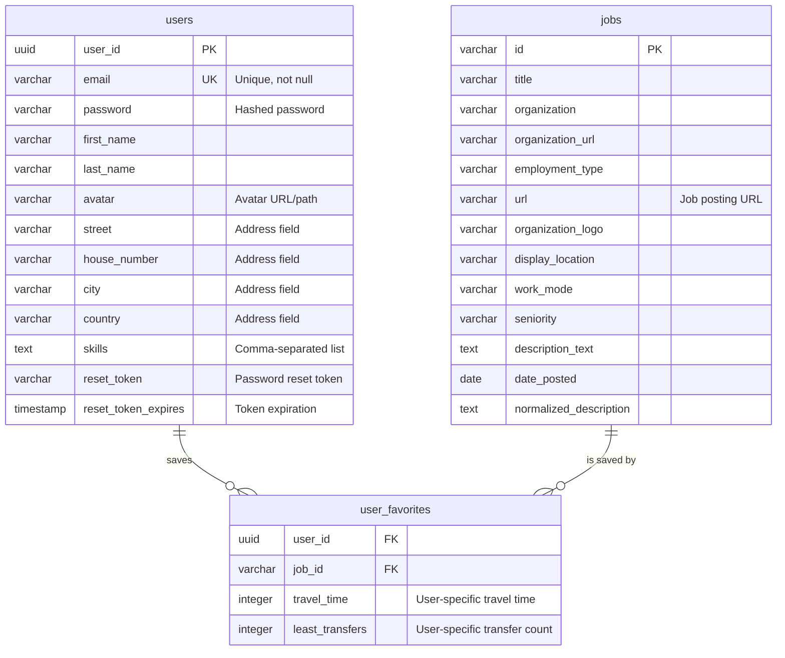

# Entity Relationship Diagram (ERD)

This diagram illustrates the current database architecture for the JobCompass application.

```mermaid
erDiagram
    users ||--o{ user_favorites : "saves"
    jobs ||--o{ user_favorites : "is saved by"

    users {
        uuid user_id PK
        varchar email UK "Unique, not null"
        varchar password "Hashed password"
        varchar first_name
        varchar last_name
        varchar avatar "Avatar URL/path"
        varchar street "Address field"
        varchar house_number "Address field"
        varchar city "Address field"
        varchar country "Address field"
        text skills "Comma-separated list"
        varchar reset_token "Password reset token"
        timestamp reset_token_expires "Token expiration"
    }

    jobs {
        varchar id PK
        varchar title
        varchar organization
        varchar organization_url
        varchar employment_type
        varchar url "Job posting URL"
        varchar organization_logo
        varchar display_location
        varchar work_mode
        varchar seniority
        text description_text
        date date_posted
        text normalized_description
    }

    user_favorites {
        uuid user_id FK
        varchar job_id FK
        integer travel_time "User-specific travel time"
        integer least_transfers "User-specific transfer count"
    }
```
