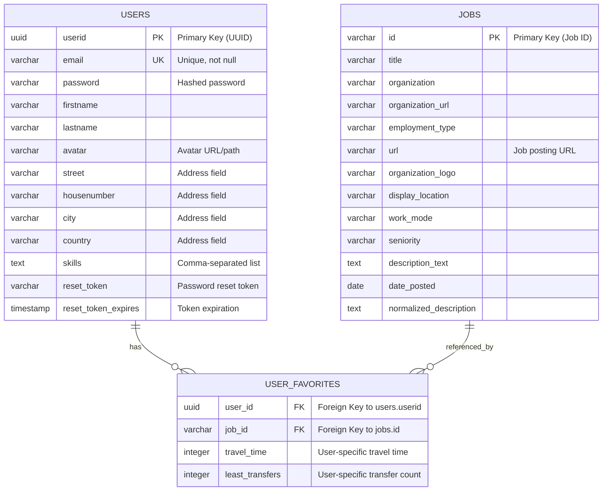

# Entity-Relationship Diagram (ERD)

## Database Architecture Overview

This document describes the entity-relationship model for the JobCompass application database (PostgreSQL/Neon).

## Entities and Relationships



## Entity Descriptions

### USERS

The `users` table stores registered user accounts with authentication and profile information.

**Key Fields:**

- **userid**: UUID primary key, generated using uuidv4()
- **email**: Unique identifier for login, not null
- **password**: Bcrypt hashed password (12 salt rounds)
- **Profile fields**: firstname, lastname, avatar
- **Address fields**: street, housenumber, city, country
- **skills**: Stored as comma-separated string, converted to/from array in application layer
- **Password reset**: reset_token, reset_token_expires for forgot password functionality

**Constraints:**

- Email must be unique
- Password is hashed before storage

### JOBS

The `jobs` table stores job posting details that have been favorited by at least one user.

**Key Fields:**

- **id**: Job identifier (primary key), typically from external job data source
- **Job details**: title, organization, employment_type, url, seniority
- **Organization info**: organization_url, organization_logo
- **Location**: display_location, work_mode
- **Description**: description_text, normalized_description
- **date_posted**: When the job was posted

**Design Notes:**

- This table stores the core job information only once, regardless of how many users favorite it
- Job data is inserted only if it doesn't already exist when a user favorites it
- No user-specific fields in this table (travel data is in the junction table)

### USER_FAVORITES

The `user_favorites` table is a junction/bridge table that creates a many-to-many relationship between users and their favorite jobs.

**Key Fields:**

- **user_id**: Foreign key to users.userid
- **job_id**: Foreign key to jobs.id
- **travel_time**: User-specific travel time to job location
- **least_transfers**: User-specific minimum number of transfers for travel

**Primary Key:**

- Composite key: (user_id, job_id)

**Design Notes:**

- This junction table also stores per-user metadata (travel_time, least_transfers)
- When a user toggles off a favorite, only the record in this table is deleted
- The favorite job record remains in the `jobs` table for other users

## Relationships

### USERS ↔ JOBS (Many-to-Many)

- **Relationship Type**: Many-to-Many
- **Junction Table**: USER_FAVORITES
- **Cardinality**:
  - One user can have zero or many favorite jobs
  - One job can be favorited by zero or many users

### CASCADE Behavior

- **User Deletion**: When a user is deleted, associated records in `user_favorites` are likely cascaded (should be verified in actual schema)
- **Job Deletion**: When a job is removed from `user_favorites`, the job record remains in `jobs` table

## Authentication & Security

### JWT Token

- Generated during login and signup
- Contains: `{ id: userid, email: email }`
- Expiry: Configurable via JWT_EXPIRES_IN environment variable
- Stored in httpOnly cookie for security

### Token Blacklist

- Implemented in-memory (blacklistedTokens)
- Used for logout functionality

### Password Management

- **Hashing**: Bcrypt with 12 salt rounds
- **Reset Flow**:
  1. Forgot password endpoint generates reset_token
  2. Token stored in users.reset_token with expiration
  3. Reset password endpoint validates token and updates password
  4. Clears reset_token and reset_token_expires after successful reset

## Database Technology

**Database**: PostgreSQL (hosted on Neon)

- Connection managed via `pg` client
- Environment variable: `DATABASE_URL`
- Connection pooling and error handling implemented in connectNeonDB.js

## Query Patterns

### USER_FULL_INFO_QUERY

A common query pattern used across multiple controllers:

```sql
SELECT
    u.userid, u.email, u.password, u.firstname, u.lastname, u.avatar,
    u.street, u.housenumber, u.city, u.country, u.skills,
    uf.travel_time, uf.least_transfers,
    j.*
FROM users u
LEFT JOIN user_favorites uf ON u.userid = uf.user_id
LEFT JOIN jobs j ON uf.job_id = j.id
```

This query:

- Retrieves complete user profile
- Includes all favorited jobs with their details
- Includes per-user travel metadata from the junction table
- Uses LEFT JOIN to include users even if they have no favorites

## API Operations

### User Operations

- **Create**: INSERT into users table
- **Read**: SELECT with LEFT JOINs to include favorites
- **Update**: UPDATE users table (profile.js)
- **Delete**: DELETE from users (cascade to user_favorites)

### Favorite Operations

- **Toggle Favorite**:
  1. Check if job exists in jobs table, insert if not
  2. Check if user_favorites record exists
  3. If exists: DELETE from user_favorites (remove favorite)
  4. If not exists: INSERT into user_favorites (add favorite)

### Password Operations

- **Change Password**: Verify current password, update with new hash
- **Forgot Password**: Generate token, store in users table
- **Reset Password**: Validate token, update password, clear token

## Notes

- Skills are stored as comma-separated strings in the database but converted to arrays in the application layer
- The application uses Firebase Admin SDK for additional authentication features (firebaseAdmin.js)
- JWT secret and expiry are configured via environment variables
- Rate limiting is implemented via middleware (rateLimiter.js)
- Image uploads handled separately via ImageUpload service
