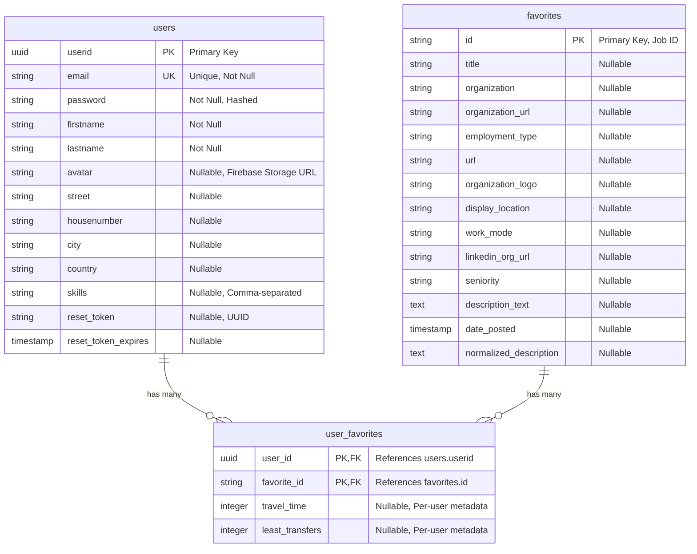

# Entity-Relationship Diagram (ERD)

## Database Architecture Overview

This document illustrates the current database architecture for the JobCompass application. The database uses PostgreSQL (Neon DB) and consists of three main tables: `users`, `favorites`, and `user_favorites` (a bridge table for the many-to-many relationship).

## ERD Diagram

## Table Descriptions

### users

The main user table storing all user account information and profile data.

**Key Fields:**

- `userid`: UUID primary key, generated using uuidv4()
- `email`: Unique email address used for authentication
- `password`: Bcrypt-hashed password (12 rounds)
- `reset_token` & `reset_token_expires`: Used for password reset functionality (10-minute expiration)

**Relationships:**

- One-to-many relationship with `user_favorites` (a user can have many favorite jobs)

### favorites

Stores job posting information that users can favorite. Each job is uniquely identified by its `id` (which corresponds to the job ID from external APIs).

**Key Fields:**

- `id`: Primary key, corresponds to external job ID
- `normalized_description`: Processed job description text for search/matching
- `description_text`: Original job description

**Relationships:**

- One-to-many relationship with `user_favorites` (a job can be favorited by many users)

### user_favorites

Bridge table implementing a many-to-many relationship between users and their favorite jobs. Also stores per-user metadata about the commute to each job.

**Key Fields:**

- `user_id`: Foreign key to `users.userid`
- `favorite_id`: Foreign key to `favorites.id`
- `travel_time`: Commute time in minutes (calculated per user)
- `least_transfers`: Minimum number of transfers required (calculated per user)

**Composite Primary Key:**

- (`user_id`, `favorite_id`) ensures a user can only favorite a job once

**Relationships:**

- Many-to-one relationship with `users`
- Many-to-one relationship with `favorites`

## Relationship Details

### Users ↔ Favorites (Many-to-Many)

- **Relationship Type**: Many-to-many via `user_favorites` bridge table
- **Cardinality**:
  - One user can favorite many jobs
  - One job can be favorited by many users
- **Metadata**: The bridge table stores per-user commute information (`travel_time`, `least_transfers`) that is specific to each user-job pair

### Key Constraints

- `users.email` is unique (enforced at application level)
- `user_favorites` has a composite primary key on (`user_id`, `favorite_id`)
- Foreign key constraints ensure referential integrity between `user_favorites` and both `users` and `favorites`

## Common Query Patterns

### Fetching User with Favorites

The application uses a unified query (`USER_FULL_INFO_QUERY`) that LEFT JOINs:

1. `users` → `user_favorites` (on `userid = user_id`)
2. `user_favorites` → `favorites` (on `favorite_id = id`)

This allows fetching a user's complete profile along with all their favorited jobs and per-user commute metadata in a single query.

### Toggle Favorite Operation

1. Check if job exists in `favorites` table (by `id`)
2. If not, insert job into `favorites` table
3. Check if relationship exists in `user_favorites`
4. If exists, delete relationship (unfavorite)
5. If not exists, insert relationship with commute metadata (favorite)

## Notes

- **Password Reset**: The `reset_token` and `reset_token_expires` fields in the `users` table are used for password reset functionality. Tokens expire after 10 minutes.
- **Skills Storage**: User skills are stored as a comma-separated string in the `users.skills` field and are parsed into arrays at the application layer.
- **Avatar Storage**: User avatars are stored in Firebase Storage, and only the URL is stored in the database.
- **Commute Data**: Travel time and transfer count are calculated per user-job pair using Google Maps API and stored in the bridge table, allowing different commute times for different users to the same job location.
