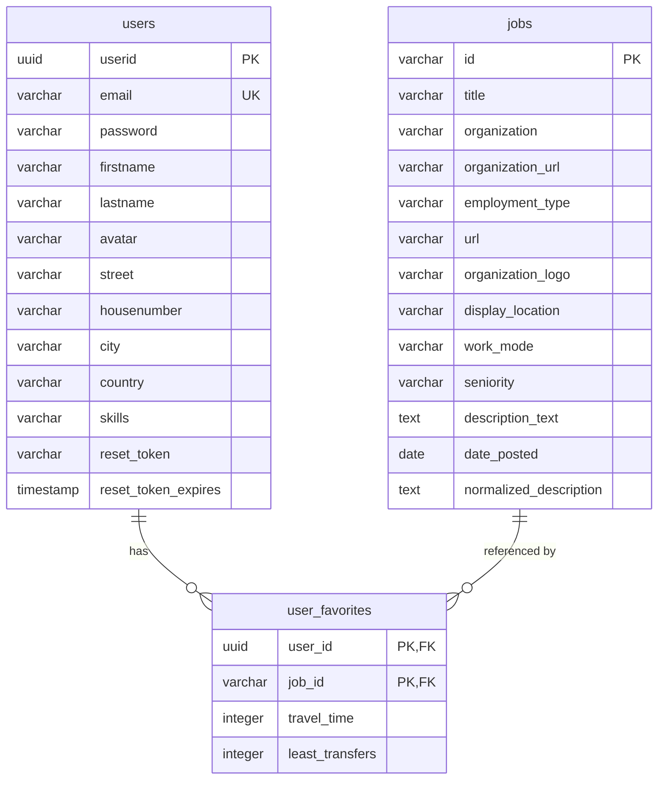

# Entity-Relationship Diagram - JobCompass Database

## Overview

This document illustrates the database architecture for the JobCompass application, which uses PostgreSQL (Neon) as its database.

## Database Schema

### Tables

#### 1. `users`

Stores user account information and profile data.

**Columns:**

- `userid` (UUID, Primary Key) - Unique identifier for each user
- `email` (VARCHAR, Unique) - User's email address for authentication
- `password` (VARCHAR) - Hashed password using bcrypt
- `firstname` (VARCHAR) - User's first name
- `lastname` (VARCHAR) - User's last name
- `avatar` (VARCHAR, Nullable) - URL to user's profile picture
- `street` (VARCHAR, Nullable) - Street address
- `housenumber` (VARCHAR, Nullable) - House number
- `city` (VARCHAR, Nullable) - City name
- `country` (VARCHAR, Nullable) - Country name
- `skills` (TEXT, Nullable) - Comma-separated list of user skills
- `reset_token` (VARCHAR, Nullable) - Password reset token
- `reset_token_expires` (TIMESTAMP, Nullable) - Token expiration time

#### 2. `jobs`

Stores job posting information that users can favorite.

**Columns:**

- `id` (VARCHAR, Primary Key) - Unique job identifier
- `title` (VARCHAR, Nullable) - Job title
- `organization` (VARCHAR, Nullable) - Company/organization name
- `organization_url` (VARCHAR, Nullable) - URL to organization's website
- `employment_type` (VARCHAR, Nullable) - Type of employment (full-time, part-time, etc.)
- `url` (VARCHAR, Nullable) - URL to job posting
- `organization_logo` (VARCHAR, Nullable) - URL to organization's logo
- `display_location` (VARCHAR, Nullable) - Job location display text
- `work_mode` (VARCHAR, Nullable) - Work mode (remote, hybrid, on-site)
- `seniority` (VARCHAR, Nullable) - Job seniority level
- `description_text` (TEXT, Nullable) - Job description
- `date_posted` (DATE, Nullable) - Date when job was posted
- `normalized_description` (TEXT, Nullable) - Processed/normalized job description

#### 3. `user_favorites` (Junction Table)

Many-to-many relationship between users and favorites with additional metadata.

**Columns:**

- `user_id` (UUID, Foreign Key → users.userid) - Reference to user
- `job_id` (VARCHAR, Foreign Key → jobs.id) - Reference to job
- `travel_time` (INTEGER, Nullable) - Travel time in minutes from user's location to job
- `least_transfers` (INTEGER, Nullable) - Minimum number of transfers required for commute

**Composite Primary Key:** (`user_id`, `job_id`)

## Relationships

### 1. User ↔ Jobs (Many-to-Many)

- **Relationship:** A user can have many favorite jobs, and a job can be favorited by many users
- **Implementation:** Through the `user_favorites` junction table
- **Cardinality:**
  - `users` 1 ←→ N `user_favorites` ←→ 1 `jobs`
  - User can have 0 or more favorite jobs
  - Job can be favorited by 0 or more users

### 2. Additional Metadata in Junction Table

The `user_favorites` table stores per-user metadata:

- `travel_time`: Personalized commute time for each user-job combination
- `least_transfers`: Personalized transfer information for each user-job combination

## Entity-Relationship Diagram (Mermaid)

## Key Design Patterns

### 1. UUID for Primary Keys

- `users.userid` uses UUID for security and scalability
- Prevents enumeration attacks and ensures global uniqueness

### 2. Junction Table with Metadata

- `user_favorites` not only links users to favorites but also stores personalized travel information
- This design allows for per-user customization of job data

### 3. Denormalized Job Data

- Job data is stored in the `jobs` table rather than normalized further
- This optimizes for read performance as job data is frequently accessed together

### 4. Flexible Skills Storage

- Skills are stored as comma-separated values in a TEXT field
- Simple implementation for the current use case, though could be normalized in the future

## Data Flow

1. **User Registration:** Creates entry in `users` table
2. **Job Search:** External API calls fetch job data (not stored in DB)
3. **Favorite Job:**
   - Job data inserted into `jobs` table (if not exists)
   - Relationship created in `user_favorites` with travel metadata
4. **User Profile Update:** Direct updates to `users` table
5. **Login Query:** Complex JOIN retrieves user data with all favorites and travel metadata

## Indexing Recommendations

Based on query patterns observed in the code:

1. **users.email** - Already unique, critical for authentication
2. **user_favorites.user_id** - For retrieving user's favorites
3. **user_favorites.job_id** - For checking which users favorited a job
4. **jobs.id** - Primary key, frequently accessed
5. **Composite index on (user_id, job_id)** - Primary key of junction table

## Security Considerations

1. **Password Hashing:** Uses bcrypt with salt rounds
2. **JWT Authentication:** Tokens stored in HTTP-only cookies
3. **Input Validation:** Server-side validation for all user inputs
4. **SQL Injection Prevention:** Uses parameterized queries throughout
