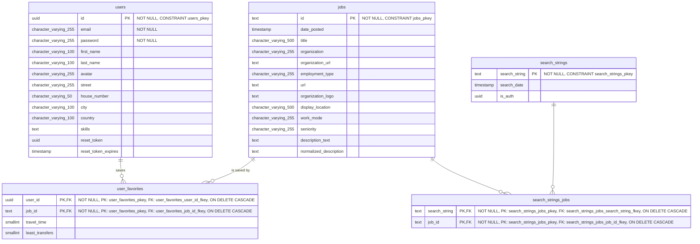

# Entity Relationship Diagram (ERD)

This diagram illustrates the current database architecture for the JobCompass application. See [`create_tables.sql`](../db_migrations/create_tables.sql) for the SQL implementation of this schema.

## Database Schema Overview

The JobCompass database consists of 5 main tables that support user management, job searching, and personalization features:

- **users** - User accounts and profile information
- **jobs** - Job listings fetched from external APIs
- **user_favorites** - Many-to-many relationship between users and saved jobs
- **search_strings** - Search query tracking with authentication context
- **search_strings_jobs** - Many-to-many relationship linking searches to resulting jobs

## Detailed Table Descriptions

### users Table

Stores user authentication and profile data:

- **Primary Key**: UUID-based unique identifier
- **Authentication**: Email and password (bcrypt hashed)
- **Profile**: Name, avatar, location details
- **Skills**: Text field for user skills and qualifications
- **Password Reset**: Token-based password recovery system

### jobs Table

Central repository for all job listings:

- **Job Identification**: Text-based ID from external APIs
- **Company Information**: Organization details, logos, and URLs
- **Job Details**: Title, description, employment type, seniority
- **Location**: Display location and work mode (remote/on-site)
- **Search Optimization**: Normalized description for better matching

### user_favorites Table

Links users to their saved jobs with commute data:

- **Composite Key**: User ID + Job ID combination
- **Commute Data**: Travel time and transfer calculations
- **Cascade Delete**: Automatic cleanup when users or jobs are removed

### search_strings Table

Tracks all search queries for caching and analytics:

- **Search Context**: The actual search string used
- **Authentication Context**: UUID of user who made the search (null for guests)
- **Timestamp**: When the search was performed
- **Cache Key**: Used for efficient result retrieval

### search_strings_jobs Table

Many-to-many relationship between searches and resulting jobs:

- **Linkage**: Connects search queries to specific job results
- **Cache Foundation**: Enables efficient result retrieval for repeated searches
- **Analytics**: Supports search result analysis and optimization

## Key Features & Implementation Details

### Authentication & Security

- **JWT-Based Authentication**: Token-based user authentication with HTTP-only cookies
- **Password Security**: bcrypt hashing for secure password storage
- **Password Reset**: Secure token-based password recovery with expiration
- **Session Management**: Secure token handling with proper expiration

### Job Search Integration

- **Multi-API Integration**: LinkedIn jobs via RapidAPI and Apify scraper
- **Intelligent Caching**: Authentication-aware caching with automatic cleanup
- **Search Optimization**: Word-by-word processing for better result coverage
- **Data Normalization**: Standardized job data from multiple sources

### Personalization Features

- **User Profiles**: Skills, location, and preference management
- **Favorites System**: Save jobs with personalized commute calculations
- **Commute Integration**: Google Maps API for travel time calculations
- **Avatar Upload**: Firebase integration for profile images

### Performance & Scalability

- **Database Optimization**: Proper indexing and query optimization
- **Database Connections**: Basic PostgreSQL client connections
- **Automated Cleanup**: Daily cron jobs for cache maintenance
- **Rate Limiting**: API protection and fair usage enforcement

### Data Processing Pipeline

- **Real-time Processing**: Immediate job search results
- **Background Processing**: Asynchronous LinkedIn scraping for authenticated users
- **Data Validation**: Comprehensive job data validation and normalization
- **Deduplication**: Cross-source job deduplication by unique identifiers

## API Integration Details

### RapidAPI LinkedIn Integration

- **Service**: LinkedIn Job Search API
- **Rate Limits**: 100 results for authenticated users, 5 for guests
- **Processing**: Real-time job fetching with immediate results
- **Location Support**: Configurable geographic filtering

### Apify LinkedIn Scraper

- **Service**: Apify LinkedIn Jobs Scraper
- **Background Processing**: Asynchronous execution for authenticated users
- **Enhanced Data**: Company information and detailed job descriptions
- **Polling**: Status monitoring with configurable timeouts

### Google Maps Integration

- **Commute Calculations**: Travel time and transfer information
- **Batch Processing**: Efficient calculation for multiple job locations
- **User Location**: Based on user profile address settings
- **Cache Storage**: Commute data persisted in user_favorites table

## Maintenance & Operations

### Automated Processes

- **Daily Cleanup**: Removal of old cache entries and expired data
- **Database Maintenance**: Performance optimization and index rebuilding
- **Error Monitoring**: Comprehensive logging and alerting
- **Health Checks**: System status monitoring and reporting

### Data Analytics

- **Search Patterns**: Analysis of popular search terms and user behavior
- **Source Effectiveness**: Tracking API performance and result quality
- **User Engagement**: Monitoring feature usage and interaction patterns
- **System Performance**: Database and application performance metrics
