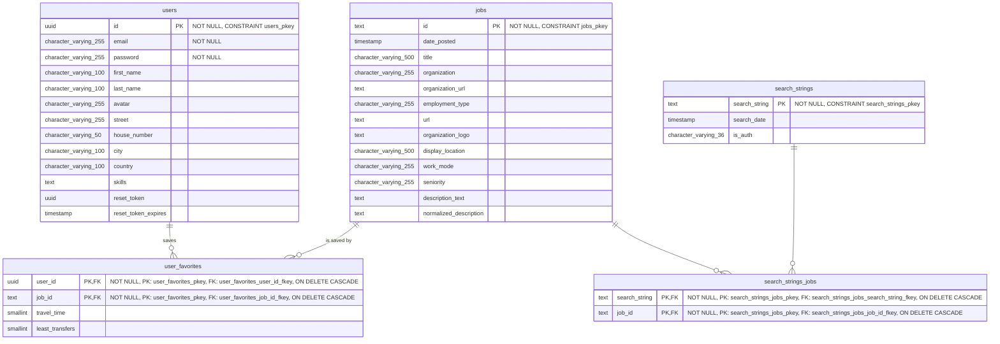

# Entity Relationship Diagram (ERD)

This diagram illustrates the current database architecture for the JobCompass application. See [`create_tables.sql`](../db_migrations/create_tables.sql) for the SQL implementation of this schema.

