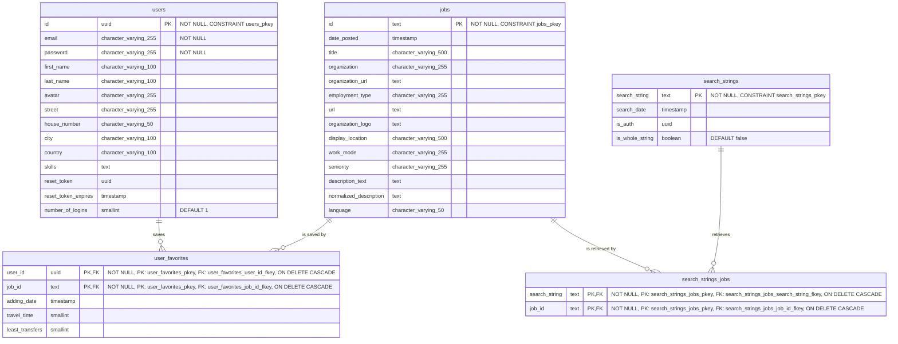

# Entity Relationship Diagram (ERD)

This document contains only the ERD, schema overview, and detailed table descriptions for JobCompass. See [`create_tables.sql`](../db_migrations/create_tables.sql) for the SQL implementation.

## Database Schema Overview

The JobCompass database consists of 5 main tables that support user management, job searching, and personalization features:

- **users** - User accounts and profile information
- **jobs** - Job listings fetched from external APIs
- **user_favorites** - Many-to-many relationship between users and saved jobs
- **search_strings** - Search query tracking with authentication context
- **search_strings_jobs** - Many-to-many relationship linking searches to resulting jobs

## Detailed Table Descriptions

### users Table

Stores user authentication and profile data:

- **Primary Key**: UUID-based unique identifier
- **Authentication**: Email and password credential fields
- **Profile**: Name, avatar, location details
- **Skills**: Text field for user skills and qualifications
- **Password Reset**: Token-based password recovery system
- **Activity Tracking**: Number of user logins (defaults to 1)

### jobs Table

Central repository for all job listings:

- **Job Identification**: Text-based ID from external APIs
- **Company Information**: Organization details, logos, and URLs
- **Job Details**: Title, description, employment type, seniority
- **Location**: Display location and work mode (remote/on-site)
- **Normalized Content**: `normalized_description` field for normalized text
- **Language**: `language` field for detected/stored language

### user_favorites Table

Links users to their saved jobs with commute data:

- **Composite Key**: User ID + Job ID combination
- **Save Timestamp**: `adding_date` records when a favorite was added
- **Commute Data**: Travel time and transfer calculations
- **Cascade Delete**: Automatic cleanup when users or jobs are removed

### search_strings Table

Tracks all search queries for caching and analytics:

- **Search Context**: The actual search string used
- **Authentication Context**: Optional UUID in `is_auth`
- **Timestamp**: When the search was performed
- **Whole String Flag**: Boolean `is_whole_string` (defaults to false)

### search_strings_jobs Table

Many-to-many relationship between searches and resulting jobs:

- **Composite Key**: Search string + job ID combination
- **Linkage**: Connects each search query to its associated job IDs
