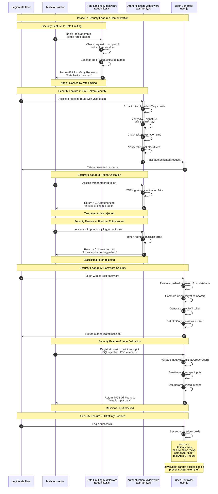

**Phase 8: Security Features**

- [← Back to Authentication Flowchart](_AuthenticationFlowchart.md)
- [← Previous: Phase 7: Account Management](7.Account%20Management.md)
- [Next → Phase 9: Error Handling](9.Error%20Handling.md)



## Security Features Overview

### 1. Rate Limiting

**File**: `server/src/middleware/rateLimiter.js`

**Purpose**: Prevent brute force attacks and abuse

- **Authentication Endpoints**: 5 requests per 5 minutes
- **IP-Based Tracking**: Limits per client IP address
- **Sliding Window**: Time-based request counting
- **429 Responses**: Clear rate limit exceeded messages

**Implementation**:

```javascript
const authLimiter = createAuthLimiter({
  max: 5,
  windowMs: 5 * 60 * 1000,
});
```

### 2. JWT Token Security

**File**: `server/src/middleware/authVerify.js`

**Purpose**: Secure authentication token management

- **Cryptographic Signing**: HMAC-SHA256 with secret key
- **Expiration Time**: Configurable token lifetime
- **Payload Verification**: User ID and email validation
- **Secure Generation**: Cryptographically random tokens

**Token Structure**:

```javascript
{
  user_id: "user-uuid",
  email: "user@example.com",
  iat: 1234567890,
  exp: 1234567890 + 24*60*60
}
```

### 3. HttpOnly Cookies

**File**: `server/src/controllers/user.js`

**Purpose**: Prevent client-side token access

- **HttpOnly Flag**: JavaScript cannot access cookies
- **SameSite Protection**: CSRF attack mitigation
- **Secure Flag**: HTTPS-only transmission (production)
- **Expiration**: 24-hour automatic timeout

**Cookie Configuration**:

```javascript
res.cookie("token", token, {
  httpOnly: true,
  secure: false, // true in production
  sameSite: "Lax",
  maxAge: 24 * 60 * 60 * 1000,
});
```

### 4. Password Security

**File**: `server/src/controllers/user.js`

**Purpose**: Secure password storage and verification

- **Bcrypt Hashing**: 12 salt rounds for security
- **Constant-Time Comparison**: Prevent timing attacks
- **Strong Requirements**: Enforced password complexity
- **Secure Updates**: Proper password change流程

**Password Requirements**:

- Minimum 8 characters
- Uppercase and lowercase letters
- Numbers and symbols
- No common patterns

### 5. Token Blacklist

**File**: `server/src/middleware/authVerify.js`

**Purpose**: Immediate token revocation

- **Logout Blacklisting**: Tokens invalidated on logout
- **Memory Storage**: Fast O(n) lookup
- **Automatic Cleanup**: Tokens expire naturally
- **Session Invalidation**: Complete logout enforcement

**Blacklist Logic**:

```javascript
export const blacklistedTokens = [];

// Check blacklist
if (blacklistedTokens.includes(token)) {
  return res.status(401).json({
    success: false,
    msg: "Token expired or logged out",
  });
}

// Add to blacklist on logout
blacklistedTokens.push(token);
```

### 6. Input Validation

**Files**: Multiple validation utilities

**Purpose**: Prevent injection attacks and data corruption

- **Server-Side Validation**: Never trust client input
- **Type Checking**: Ensure proper data types
- **Length Limits**: Prevent buffer overflow attacks
- **Sanitization**: Remove malicious content

**Validation Examples**:

```javascript
// Email validation
const emailRegex = /^[^\s@]+@[^\s@]+\.[^\s@]+$/;

// Password strength
const passwordRules = {
  length: (pw) => pw.length >= 8,
  uppercase: (pw) => /[A-Z]/.test(pw),
  lowercase: (pw) => /[a-z]/.test(pw),
  number: (pw) => /\d/.test(pw),
  symbol: (pw) => /[!@#$%^&*(),.?":{}|<>]/.test(pw),
};
```

### 7. CORS and Headers

**File**: `server/src/app.js`

**Purpose**: Secure cross-origin requests

- **CORS Configuration**: Controlled origin access
- **Security Headers**: Additional protection layers
- **Content Type**: Proper MIME type handling

## Security Headers

### Recommended Headers

```javascript
// Security headers (to be implemented)
app.use(
  helmet({
    contentSecurityPolicy: {
      directives: {
        defaultSrc: ["'self'"],
        styleSrc: ["'self'", "'unsafe-inline'"],
        scriptSrc: ["'self'"],
        imgSrc: ["'self'", "data:", "https:"],
      },
    },
    hsts: {
      maxAge: 31536000,
      includeSubDomains: true,
      preload: true,
    },
  }),
);
```

## Threat Mitigation

### 1. Brute Force Attacks

- **Rate Limiting**: Throttles login attempts
- **Account Lockout**: Temporary blocking after failures
- **IP Tracking**: Per-client request limits

### 2. Cross-Site Scripting (XSS)

- **HttpOnly Cookies**: Prevent token theft
- **Input Sanitization**: Remove malicious scripts
- **Content Security Policy**: Restrict script sources

### 3. Cross-Site Request Forgery (CSRF)

- **SameSite Cookies**: Prevent cross-site requests
- **CSRF Tokens**: Additional request validation
- **Origin Checking**: Verify request sources

### 4. SQL Injection

- **Parameterized Queries**: Safe database operations
- **Input Validation**: Type and format checking
- **ORM Usage**: Abstracted database access

### 5. Session Hijacking

- **Secure Cookies**: HTTPS-only transmission
- **Token Expiration**: Automatic session timeout
- **Token Rotation**: Fresh tokens on login

## Security Monitoring

### Logging

- **Authentication Events**: Login, logout, failures
- **Security Violations**: Rate limit exceeded, invalid tokens
- **Error Tracking**: Monitor for attack patterns

### Alerts

- **Suspicious Activity**: Multiple failed logins
- **Anomalous Behavior**: Unusual access patterns
- **Security Events**: Token blacklist additions

## Best Practices

### Development

- **Environment Variables**: Secure secret management
- **Dependency Updates**: Regular security patches
- **Code Reviews**: Security-focused reviews

### Production

- **HTTPS Enforcement**: Secure all communications
- **Security Headers**: Additional protection layers
- **Regular Audits**: Security assessment and testing

### Compliance

- **GDPR Compliance**: Data protection requirements
- **Privacy Policies**: Transparent data handling
- **Data Retention**: Appropriate data lifecycle
