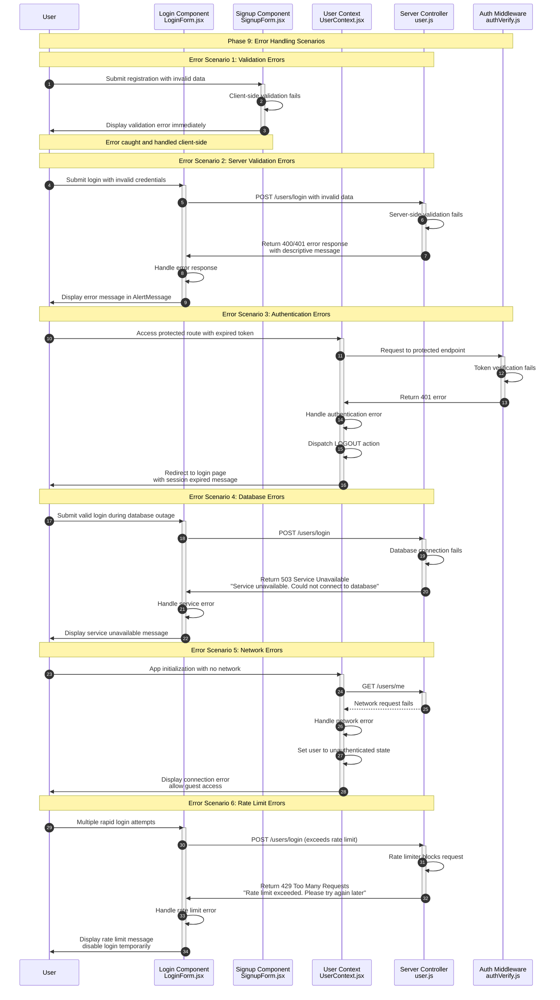

**Phase 9: Error Handling**

- [← Back to Authentication Flowchart](_AuthenticationFlowchart.md)
- [← Previous: Phase 8: Security Features](8.Security%20Features.md)
- [Next → Phase 10: API Reference](10.API%20Reference.md)



## Error Handling Strategy

### 1. Client-Side Validation

**Purpose**: Immediate feedback, reduce server load

**Implementation**:

- Real-time form validation
- Password strength checking
- Email format verification
- Required field validation

**Benefits**:

- Instant user feedback
- Reduced server requests
- Better user experience
- Lower server load

### 2. Server-Side Validation

**Purpose**: Security, data integrity

**Implementation**:

- Input sanitization
- Type checking
- Business rule validation
- Security constraint enforcement

**Error Responses**:

```javascript
// Validation error response
{
  success: false,
  msg: "Email already registered"
}

// Detailed validation errors
{
  success: false,
  msg: "Email is required\nPassword is too short"
}
```

### 3. Authentication Error Handling

**Purpose**: Secure session management

**Scenarios**:

- Invalid/expired tokens
- Blacklisted tokens
- Missing authentication
- Session timeout

**Handling Strategy**:

- Automatic logout on auth errors
- Redirect to login page
- Clear user context
- Display appropriate messages

### 4. Database Error Handling

**Purpose**: Graceful degradation

**Error Types**:

- Connection failures
- Query errors
- Constraint violations
- Transaction failures

**Response Strategy**:

- 503 Service Unavailable for connection issues
- 500 Internal Server for query errors
- Graceful degradation where possible
- User-friendly error messages

### 5. Network Error Handling

**Purpose**: Resilient user experience

**Scenarios**:

- Connection timeouts
- Network interruptions
- Server unavailability
- CORS issues

**Handling Approach**:

- Retry mechanisms for transient failures
- Offline mode support
- Clear error messaging
- Fallback functionality

## Error Response Standards

### HTTP Status Codes

- **200 OK**: Successful operation
- **201 Created**: Resource created successfully
- **400 Bad Request**: Invalid input data
- **401 Unauthorized**: Authentication required/failed
- **404 Not Found**: Resource not found
- **429 Too Many Requests**: Rate limit exceeded
- **500 Internal Server**: Server error
- **503 Service Unavailable**: Database/connection issues

### Response Format

```javascript
// Success response
{
  success: true,
  user: { /* user data */ },
  token: "jwt-token"
}

// Error response
{
  success: false,
  msg: "Descriptive error message"
}
```

## Error Handling by Component

### 1. Forms (Login, Signup, Profile)

**Validation Errors**:

- Real-time client validation
- Server validation feedback
- Field-specific error messages
- Form-wide error display

**Submission Errors**:

- Network error handling
- Server error responses
- Loading state management
- Retry mechanisms

### 2. Authentication Context

**Token Errors**:

- Automatic logout on invalid tokens
- Session expiration handling
- Token refresh attempts
- Guest mode fallback

**API Errors**:

- Global error handling
- User notification system
- Error state management
- Recovery mechanisms

### 3. Protected Routes

**Access Errors**:

- Authentication requirement checking
- Redirect to login on auth failure
- Error message display
- State cleanup on errors

**Permission Errors**:

- Role-based access control
- Resource ownership verification
- Access denied responses
- Graceful fallbacks

### 4. API Controllers

**Input Validation**:

- Comprehensive input checking
- Type and format validation
- Business rule enforcement
- Security constraint validation

**Database Errors**:

- Connection error handling
- Transaction rollback on errors
- Constraint violation handling
- Error logging and monitoring

## Error Recovery Strategies

### 1. Automatic Recovery

**Network Issues**:

- Exponential backoff retry
- Connection timeout handling
- Offline mode support
- Sync when connection restored

**Transient Errors**:

- Automatic retry for temporary failures
- Circuit breaker pattern
- Fallback to cached data
- Progressive enhancement

### 2. User-Initiated Recovery

**Manual Retry**:

- Retry buttons on failed operations
- Refresh mechanisms
- Re-authentication prompts
- Data re-submission options

**Alternative Actions**:

- Suggested workarounds
- Alternative input methods
- Different authentication options
- Support contact information

### 3. Graceful Degradation

**Feature Reduction**:

- Disable non-essential features
- Fallback to basic functionality
- Read-only mode when appropriate
- Cached data usage

**Error Boundaries**:

- Component-level error isolation
- Prevent app crashes
- Error reporting mechanisms
- Recovery state management

## Error Monitoring and Logging

### 1. Client-Side Logging

**Error Tracking**:

- JavaScript error capture
- API request/response logging
- User interaction errors
- Performance issues

**User Feedback**:

- Error report collection
- User context information
- Reproduction steps
- Browser/environment details

### 2. Server-Side Logging

**Security Events**:

- Authentication failures
- Rate limit violations
- Suspicious activity
- Access attempts

**System Errors**:

- Database connection issues
- Application errors
- Performance problems
- Resource constraints

### 3. Error Analytics

**Pattern Recognition**:

- Common error identification
- Error frequency analysis
- User impact assessment
- Performance correlation

**Alerting**:

- Critical error notifications
- Threshold-based alerts
- Anomaly detection
- Escalation procedures

## User Experience Considerations

### 1. Clear Communication

**Error Messages**:

- User-friendly language
- Specific problem description
- Suggested solutions
- Next steps guidance

**Visual Feedback**:

- Consistent error styling
- Appropriate severity indicators
- Clear error locations
- Dismissible notifications

### 2. Progressive Disclosure

**Error Details**:

- Simple message by default
- Technical details on demand
- Stack traces for developers
- Debug information options

**Help Resources**:

- Contextual help links
- FAQ suggestions
- Support contact options
- Documentation references

### 3. Accessibility

**Screen Readers**:

- Proper error announcement
- Focus management
- Semantic error markup
- Alternative text for errors

**Keyboard Navigation**:

- Error focus handling
- Keyboard-accessible error dismissal
- Tab order preservation
- Escape key handling
