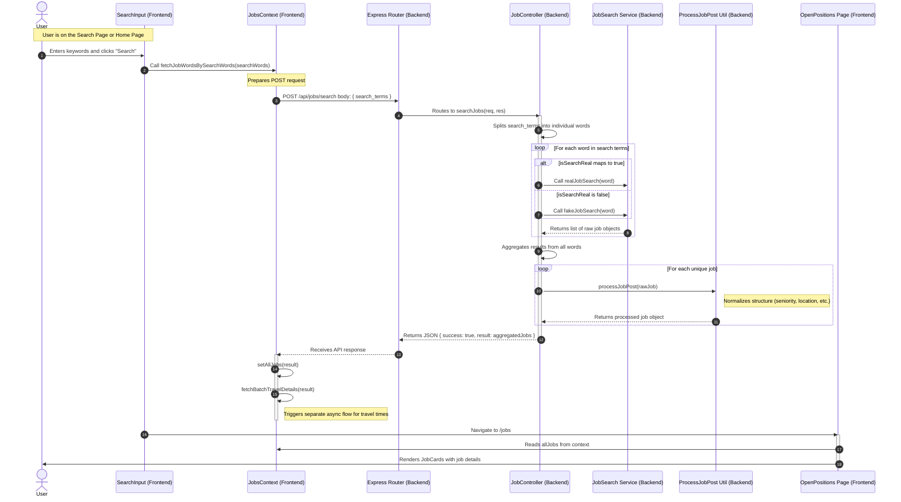

# Job Fetch Flow

This document illustrates the flow of data when a user searches for jobs, from the initial button click to the display of results.

## Flow Diagram

## Detailed Explanation

1.  **User Interaction**: The user enters search terms in the `SearchInput` component and clicks the "Search" button.
2.  **State Initiation**: The `handleSearch` function in `SearchInput` cleans the input and calls `fetchJobWordsBySearchWords` from the `JobsContext`.
3.  **API Request**: `JobsContext` sends a `POST` request to the backend endpoint `/api/jobs/search` with the search terms.
4.  **Backend Routing**: The Express app receives the request and routes it via `server/src/routes/job.js` to the `searchJobs` controller in `server/src/controllers/jobData.js`.
5.  **Data Retrieval**:
    - The controller splits the search query into words.
    - It fetches job data for each word using either `realJobSearch` (scraping/API) or `fakeJobSearch` (local JSON dataset), depending on the `isSearchReal` flag.
6.  **Data Processing**: Raw job data is passed through `processJobPost`, which normalizes fields like seniority, employment type, and location to ensure consistency.
7.  **Response**: The processed list of jobs is sent back to the client as a JSON response.
8.  **State Update**: `JobsContext` receives the response, updates the `allJobs` state, and initiates a secondary fetch for travel details (`fetchBatchTravelDetails`).
9.  **Display**: The user is navigated to the `/jobs` route, where the `OpenPositions` component renders the job list using data from the `JobsContext`.
