# Job Search Fetch Flow (Search Button → OpenPositions Results)

## Overview

This document illustrates the complete data flow when a user clicks the "Search" button on the JobSearch page and receives job results on the OpenPositions page. The flow includes both frontend and backend components with detailed interactions.

```mermaid
%%{init: {'theme': 'dark', 'themeVariables': { 'primaryColor':'#1a1a1a', 'primaryBorderColor':'#4a9eff', 'lineColor':'#4a9eff', 'tertiaryColor':'#2a2a2a', 'tertiaryBorderColor':'#4a9eff', 'tertiaryTextColor':'#ffffff'}, 'sequence': {'actorMargin': 50}}}%%
sequenceDiagram
    actor User
    participant JobSearch as JobSearch Page<br/>`JobSearch.jsx`
    participant SearchInput as SearchInput Component<br/>`SearchInput.jsx`
    participant Router as React Router<br/>(client-side navigation)
    participant JobsContext as JobsContext Provider<br/>`JobsContext.jsx`
    participant useFetch_1 as useFetch Hook<br/>(jobs search)<br/>`useFetch.js`
    participant FrontendNetwork as HTTP Network Layer
    participant ExpressApp as Express Server<br/>`app.js`
    participant JobRouter as Job Routes<br/>`job.js`
    participant JobController as Job Search Controller<br/>`jobData.js`<br/>`searchJobs()`
    participant FakeJobSearch as Fake Job Search Provider<br/>`fakeJobSearch.js`
    participant ProcessJobPost as Job Normalizer<br/>`processJobPost.js`
    participant useFetch_2 as useFetch Hook<br/>(travel batch)<br/>`useFetch.js`
    participant TravelRouter as Travel Routes<br/>`travel.js`
    participant TravelController as Travel Controller<br/>`travelController.js`<br/>`calculateBatchTravelTime()`
    participant GoogleMapsAPI as Google Maps API<br/>`googleMapsApi.js`
    participant OpenPositions as OpenPositions Page<br/>`OpenPositions.jsx`

    User->>SearchInput: Clicks "Search" button<br/>(or presses Enter)

    rect rgb(60, 100, 150)
    Note over SearchInput,Router: Phase 1: Input Validation & Initial Setup
    SearchInput->>SearchInput: `handleSearch()` triggered
    SearchInput->>SearchInput: Validate input with<br/>`validateJobInput()`<br/>(from `searchValidation.js`)
    SearchInput->>SearchInput: Clean input text with<br/>`cleanUpText()`
    end

    rect rgb(100, 120, 80)
    Note over SearchInput,JobsContext: Phase 2: Context State Updates
    SearchInput->>JobsContext: Call `setAllJobs([])`<br/>(clear previous results)
    SearchInput->>JobsContext: Call `setSearchTerm(inputValue)`<br/>(store search query)
    SearchInput->>JobsContext: Call `fetchJobWordsBySearchWords(inputValue)`<br/>with cleaned search term
    end

    rect rgb(150, 120, 60)
    Note over Router: Phase 3: Navigation
    SearchInput->>Router: `navigate("/jobs")`<br/>(redirect to OpenPositions)
    SearchInput->>SearchInput: Clear input field value
    end

    rect rgb(60, 120, 130)
    Note over JobsContext,FakeJobSearch: Phase 4: Job Search Fetch
    JobsContext->>JobsContext: `fetchJobWordsBySearchWords()` executes<br/>inside JobsProvider
    JobsContext->>useFetch_1: Call `performFetch()` with<br/>method: POST<br/>body: { search_terms: "<user input>" }

    useFetch_1->>useFetch_1: Set `isLoading = true`
    useFetch_1->>useFetch_1: Set `error = null`
    useFetch_1->>FrontendNetwork: POST /api/jobs/search

    FrontendNetwork->>ExpressApp: HTTP POST request arrives
    ExpressApp->>JobRouter: Route `/jobs/search`

    JobRouter->>JobController: Invoke `searchJobs(req, res)`

    JobController->>JobController: Validate `search_terms` exists<br/>& is non-empty string
    JobController->>JobController: Split search terms into words:<br/>`searchWords = search_terms.split(/[\\s\\-.'/]+/)`

    JobController->>FakeJobSearch: For each search word,<br/>call `fakeJobSearch(jobWord)`<br/>(or `realJobSearch` if enabled)

    FakeJobSearch->>FakeJobSearch: Load `JobsDataset.json`
    FakeJobSearch->>FakeJobSearch: Filter jobs where<br/>`job.title.toLowerCase()`<br/>includes `jobWord.toLowerCase()`
    FakeJobSearch-->>JobController: Return filtered job array

    JobController->>JobController: Aggregate results from all words<br/>Remove duplicates using Set of job IDs<br/>Maintain insertion order

    JobController->>ProcessJobPost: For each aggregated job,<br/>call `processJobPost(job)`

    ProcessJobPost->>ProcessJobPost: Normalize job fields:<br/>- Parse & clean description<br/>- Extract & format location<br/>- Standardize salary info<br/>- Format dates & URLs<br/>- Add computed fields
    ProcessJobPost-->>JobController: Return normalized job object

    JobController->>ExpressApp: Return response with<br/>aggregated, normalized jobs

    ExpressApp->>FrontendNetwork: HTTP 200<br/>{ success: true,<br/>  result: [job1, job2, ...] }

    FrontendNetwork->>useFetch_1: Response received
    useFetch_1->>useFetch_1: Parse JSON response
    useFetch_1->>JobsContext: Call `handleJobFetchResults(data)`<br/>(callback function)

    end

    rect rgb(130, 80, 130)
    Note over JobsContext,GoogleMapsAPI: Phase 5: Travel Details Fetch
    JobsContext->>JobsContext: In `handleJobFetchResults()`:
    JobsContext->>JobsContext: Call `setAllJobs(data.result)`<br/>(update all jobs)
    JobsContext->>JobsContext: Extract unique work cities:<br/>`getCitiesToFetch(jobsArray)`
    JobsContext->>JobsContext: Build `homeAddress` object from<br/>logged-in user profile

    JobsContext->>useFetch_2: Call `performTravelFetch()` with<br/>method: POST<br/>body: { homeAddress, workCities }

    useFetch_2->>useFetch_2: Set `isLoading = true` for travel
    useFetch_2->>FrontendNetwork: POST /api/travel/batch

    FrontendNetwork->>ExpressApp: HTTP POST request arrives
    ExpressApp->>TravelRouter: Route `/travel/batch`

    TravelRouter->>TravelController: Invoke `calculateBatchTravelTime(req, res)`

    TravelController->>TravelController: Extract & format home address
    TravelController->>TravelController: For each work city:
    TravelController->>TravelController: Check if city matches home city<br/>(regex match on city name)
    alt City matches home city
        TravelController->>TravelController: Return zero travel time<br/>& zero transfers
    else City is different
        TravelController->>GoogleMapsAPI: Call `getTransitRouteSummary()`<br/>with formatted addresses
        GoogleMapsAPI->>GoogleMapsAPI: Query Google Maps Transit API<br/>Get optimal transit route
        GoogleMapsAPI-->>TravelController: Return travel time (minutes)<br/>& number of transfers
    end

    TravelController->>TravelController: Aggregate all travel results<br/>into array of city → travel data
    TravelController->>ExpressApp: Return response with<br/>travel details for all cities

    ExpressApp->>FrontendNetwork: HTTP 200<br/>{ success: true,<br/>  result: { travelDetails: [...] } }

    FrontendNetwork->>useFetch_2: Response received
    useFetch_2->>useFetch_2: Parse JSON response
    useFetch_2->>JobsContext: Call `handleTravelFetchResults(data)`<br/>(callback function)

    JobsContext->>JobsContext: In `handleTravelFetchResults()`:
    JobsContext->>JobsContext: Merge travel details into<br/>`travelDetails` map<br/>`{ cityName: { travel_time, least_transfers } }`
    JobsContext->>JobsContext: Update state: `setTravelDetails(detailsMap)`

    end

    rect rgb(120, 120, 70)
    Note over JobsContext,OpenPositions: Phase 6: Display Results
    JobsContext->>JobsContext: `getJobsWithTravel()` merges<br/>job data with travel info<br/>for each job:
    JobsContext->>JobsContext: Append travel_time & least_transfers<br/>from `travelDetails[city]`

    Router->>OpenPositions: Route change complete,<br/>component renders

    OpenPositions->>JobsContext: Read from context:
    OpenPositions->>JobsContext: - `allJobs` (with travel data)<br/>- `searchTerm`<br/>- `isJobsLoading`<br/>- `jobFetchError`<br/>- `travelFetchError`

    OpenPositions->>OpenPositions: Enrich jobs with skills:<br/>For each job & user skill,<br/>call `getSkillsInDescription()`<br/>to find matching skills

    OpenPositions->>OpenPositions: Apply filters from user selection<br/>using `filterJobs()`<br/>(seniority, employment type, work mode)

    OpenPositions->>OpenPositions: Apply sorting from dropdown<br/>using `createSortComparator()`<br/>(skill matches, transfers, distance, date)

    OpenPositions->>OpenPositions: Paginate results<br/>(5 jobs per page)

    OpenPositions->>OpenPositions: Render results:<br/>- Loading spinner while isJobsLoading<br/>- Error message if jobFetchError<br/>- Job list with job cards
    OpenPositions->>OpenPositions: Each job card shows:<br/>job title, company, skills match,<br/>travel time, transfers, location,<br/>salary, and favorite button
    OpenPositions->>User: Display job results page

    end

    User->>OpenPositions: View, filter, sort, and<br/>interact with job results
```

## Key Components Explained

### Frontend Components

- **SearchInput.jsx**: Captures user input, validates it, triggers context update and navigation
- **JobsContext.jsx**: Manages global state for jobs and travel details, orchestrates two fetch calls
- **useFetch.js**: Custom hook that handles HTTP requests with loading/error states
- **OpenPositions.jsx**: Displays results with filtering, sorting, and pagination

### Backend Components

- **app.js**: Express server entry point
- **job.js**: Defines `/api/jobs/search` POST route
- **jobData.js** (`searchJobs`): Controller that processes search terms, fetches from job provider, and normalizes results
- **fakeJobSearch.js**: Searches in-memory JobsDataset.json (can be swapped with realJobSearch)
- **processJobPost.js**: Normalizes job data fields (description, location, salary, dates, etc.)
- **travel.js**: Defines `/api/travel/batch` POST route
- **travelController.js** (`calculateBatchTravelTime`): Calculates travel times from home to work cities
- **googleMapsApi.js**: Queries Google Maps API for transit routes

## Data Flow Summary

1. **Input & Validation** → User clicks search, input is validated and cleaned
2. **State Update** → Search term and context callbacks are set
3. **Navigation** → User is navigated to OpenPositions page
4. **Job Fetch** → POST `/api/jobs/search` with search terms, receives normalized jobs
5. **Travel Fetch** → POST `/api/travel/batch` with home address and work cities, receives travel times
6. **Display** → Jobs enriched with skills matching, travel info, filtered, sorted, and paginated
7. **User Interaction** → User can filter, sort, paginate through results

## Notes

- The fake job search filters the static JobsDataset.json
- Real job search (when enabled) would call external job APIs
- Google Maps API calls are concurrent (Promise.all) for performance
- Travel times are cached in context for reuse on subsequent page visits
- Error handling occurs at both fetch and display levels
