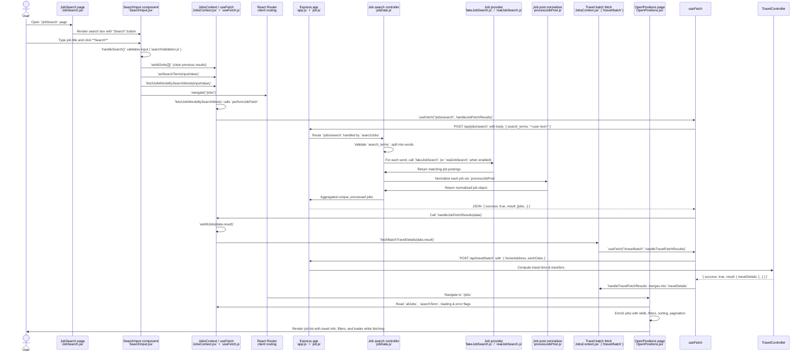

## Job search fetch flow (Search → OpenPositions)

```mermaid
sequenceDiagram
    actor User
    participant JobSearch as JobSearch page<br/>`JobSearch.jsx`
    participant SearchInput as SearchInput component<br/>`SearchInput.jsx`
    participant JobsContext as JobsContext / useFetch<br/>`JobsContext.jsx` + `useFetch.js`
    participant FE_Router as React Router<br/>client routing
    participant BE_Express as Express app<br/>`app.js` + `job.js`
    participant JobController as Job search controller<br/>`jobData.js`
    participant JobProvider as Job provider<br/>`fakeJobSearch.js` / `realJobSearch.js`
    participant JobPostProcessor as Job post normalizer<br/>`processJobPost.js`
    participant TravelContext as Travel batch fetch<br/>`JobsContext.jsx` (`/travel/batch`)
    participant OpenPositions as OpenPositions page<br/>`OpenPositions.jsx`

    User ->> JobSearch: Open `/jobSearch` page
    JobSearch ->> SearchInput: Render search box with "Search" button

    User ->> SearchInput: Type job title and click **Search**
    SearchInput ->> SearchInput: `handleSearch()` validates input (`searchValidation.js`)
    SearchInput ->> JobsContext: `setAllJobs([])` (clear previous results)
    SearchInput ->> JobsContext: `setSearchTerm(inputValue)`
    SearchInput ->> JobsContext: `fetchJobWordsBySearchWords(inputValue)`
    SearchInput ->> FE_Router: `navigate("/jobs")`

    JobsContext ->> JobsContext: `fetchJobWordsBySearchWords` calls `performJobFetch`
    JobsContext ->> useFetch: `useFetch("/jobs/search", handleJobFetchResults)`
    useFetch ->> BE_Express: `POST /api/jobs/search` with body `{ search_terms: "<user text>" }`

    BE_Express ->> JobController: Route `/jobs/search` handled by `searchJobs`
    JobController ->> JobController: Validate `search_terms`, split into words
    JobController ->> JobProvider: For each word, call `fakeJobSearch` (or `realJobSearch` when enabled)
    JobProvider ->> JobController: Return matching job postings
    JobController ->> JobPostProcessor: Normalize each job via `processJobPost`
    JobPostProcessor ->> JobController: Return normalized job object
    JobController ->> BE_Express: Aggregated unique, processed jobs
    BE_Express -->> useFetch: JSON `{ success: true, result: [jobs...] }`

    useFetch ->> JobsContext: Call `handleJobFetchResults(data)`
    JobsContext ->> JobsContext: `setAllJobs(data.result)`
    JobsContext ->> TravelContext: `fetchBatchTravelDetails(data.result)`

    TravelContext ->> useFetch: `useFetch("/travel/batch", handleTravelFetchResults)`
    useFetch ->> BE_Express: `POST /api/travel/batch` with `{ homeAddress, workCities }`
    BE_Express ->> TravelController: Compute travel time & transfers
    TravelController -->> useFetch: `{ success: true, result: { travelDetails: [...] } }`
    useFetch ->> TravelContext: `handleTravelFetchResults` merges into `travelDetails`

    FE_Router ->> OpenPositions: Navigate to `/jobs`
    OpenPositions ->> JobsContext: Read `allJobs`, `searchTerm`, loading & error flags
    OpenPositions ->> OpenPositions: Enrich jobs with skills, filters, sorting, pagination
    OpenPositions ->> User: Render job list with travel info, filters, and loader while fetching
```

