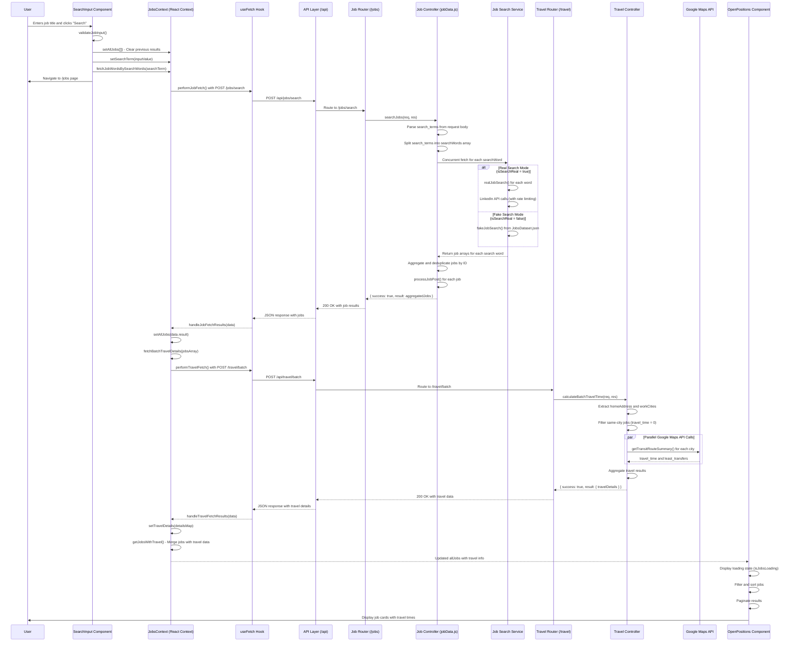

# Job Fetch Flow Diagram

This document illustrates the complete flow from when a user presses the "Search" button until results are displayed on the "Open Positions" page.

## Flow Diagram

## Component Details

### Frontend Components

1. **SearchInput Component** (`client/src/components/SearchInput/SearchInput.jsx`)

   - Handles user input validation
   - Triggers the search process
   - Navigates to results page

2. **JobsContext** (`client/src/context/JobsContext.jsx`)

   - Manages global job state
   - Coordinates job and travel data fetching
   - Provides data to consuming components

3. **useFetch Hook** (`client/src/hooks/useFetch.js`)

   - Generic HTTP client for API communication
   - Handles loading states and error management
   - Supports request cancellation

4. **OpenPositions Component** (`client/src/pages/openPositions/openPositions.jsx`)
   - Displays job search results
   - Handles filtering, sorting, and pagination
   - Shows loading and error states

### Backend Components

1. **Job Router** (`server/src/routes/job.js`)

   - Express router for job-related endpoints
   - Routes `/jobs/search` to job controller

2. **Job Controller** (`server/src/controllers/jobData.js`)

   - Main business logic for job search
   - Coordinates between real and fake search services
   - Aggregates and deduplicates results

3. **Job Search Services**

   - **realJobSearch.js**: LinkedIn API integration with rate limiting
   - **fakeJobSearch.js**: Local dataset search for development

4. **Travel Router** (`server/src/routes/travel.js`)

   - Express router for travel-related endpoints
   - Routes `/travel/batch` to travel controller

5. **Travel Controller** (`server/src/controllers/travelController.js`)

   - Calculates travel times for multiple job locations
   - Optimizes same-city vs. external city calculations
   - Manages concurrent Google Maps API calls

6. **Google Maps Service** (`server/src/services/googleMapsApi.js`)
   - External API integration for transit directions
   - Calculates travel time and transfer counts
   - Handles API key management

## Data Flow

1. **Search Request**: User input → validation → API call
2. **Job Fetch**: API → job controller → search service → job aggregation
3. **Travel Calculation**: Job locations → travel controller → Google Maps API → travel details
4. **Result Display**: Merged job+travel data → UI rendering with filtering/sorting

## Key Features

- **Concurrent Processing**: Multiple search words and travel calculations run in parallel
- **Rate Limiting**: LinkedIn API calls are staggered to avoid rate limits
- **Smart Travel**: Same-city jobs get zero travel time without API calls
- **Error Handling**: Comprehensive error handling at each layer
- **Loading States**: UI shows appropriate loading indicators during fetch operations
- **Data Deduplication**: Jobs are deduplicated by ID across multiple search terms

## Environment Variables

- `X_RAPIDAPI_KEY`: LinkedIn API key for real job search
- `GOOGLE_MAPS_API_KEY`: Google Maps API key for travel calculations
- `isSearchReal`: Flag to switch between real and fake job search modes
