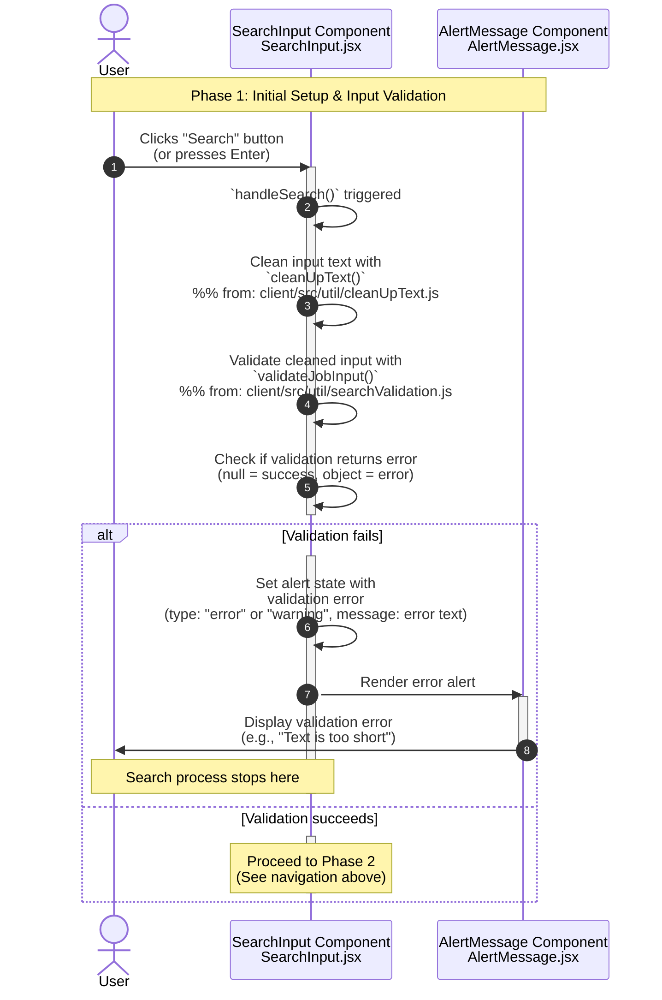

**Phase 1: Initial Setup & Input Validation**

- [← Back to Job Fetch Flowchart](_JobFetchFlowchart.md)
- [Previous] - (This is the first phase)
- [Next → Phase 2: Context State Updates](2.Context%20State%20Updates.md)

## Technical Implementation Details

### Input Validation Logic

The validation process uses the `validateJobInput()` function from `client/src/util/searchValidation.js` which checks for:

- **Empty string**: Returns error if text is empty
- **Invalid characters**: Only allows letters, numbers, spaces, and these symbols: -.'/
- **Numbers-only**: Returns warning if text consists only of numbers
- **Returns**: `null` for success, or `{type, message}` object for errors/warnings

### Text Cleaning Process

The `cleanUpText()` function from `client/src/util/cleanUpText.js` performs:

- Normalization of multiple consecutive spaces to single space
- Normalization of multiple consecutive hyphens to single hyphen
- Normalization of multiple consecutive forward slashes to single slash
- Normalization of multiple consecutive apostrophes to single apostrophe
- Normalization of multiple consecutive periods to single period
- Trimming of leading/trailing whitespace

### Error Handling

Validation errors are displayed through the AlertMessage component with:

- Error type classification
- User-friendly error messages
- Automatic dismissal after a set timeout
- Consistent styling with the application's design system
