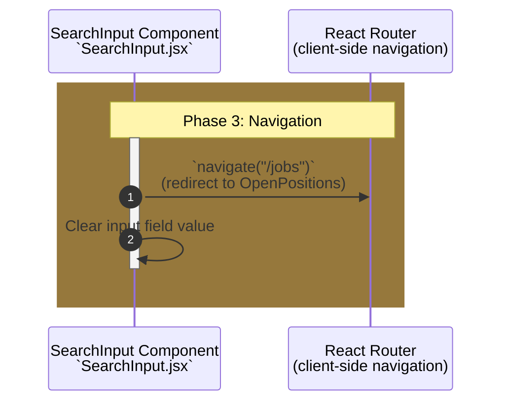

```mermaid
sequenceDiagram
    autonumber
    participant SearchInput as SearchInput Component<br/>`SearchInput.jsx`
    participant Router as React Router<br/>(client-side navigation)

    rect rgb(150, 120, 60)
    Note over SearchInput,Router: Phase 3: Navigation
    activate SearchInput
    SearchInput->>Router: `navigate("/jobs")`<br/>(redirect to OpenPositions)
    SearchInput->>SearchInput: Clear input field value
    deactivate SearchInput
    end
```
