**Phase 3: Navigation**
- [← Back to Job Fetch Flowchart](_JobFetchFlowchart.md)
- [← Previous: Phase 2: Context State Updates](2.Context%20State%20Updates.md)
- [Next → Phase 4: Job Search Fetch](4.Job%20Search%20Fetch.md)

```mermaid
sequenceDiagram
    autonumber
    participant SearchInput as SearchInput Component<br/>`SearchInput.jsx`
    participant Router as React Router<br/>(client-side navigation)

    Note over SearchInput,Router: Phase 3: Navigation
    activate SearchInput
    SearchInput->>Router: `navigate("/jobs")`<br/>(redirect to OpenPositions)
    SearchInput->>SearchInput: Clear input field value
    deactivate SearchInput
```

