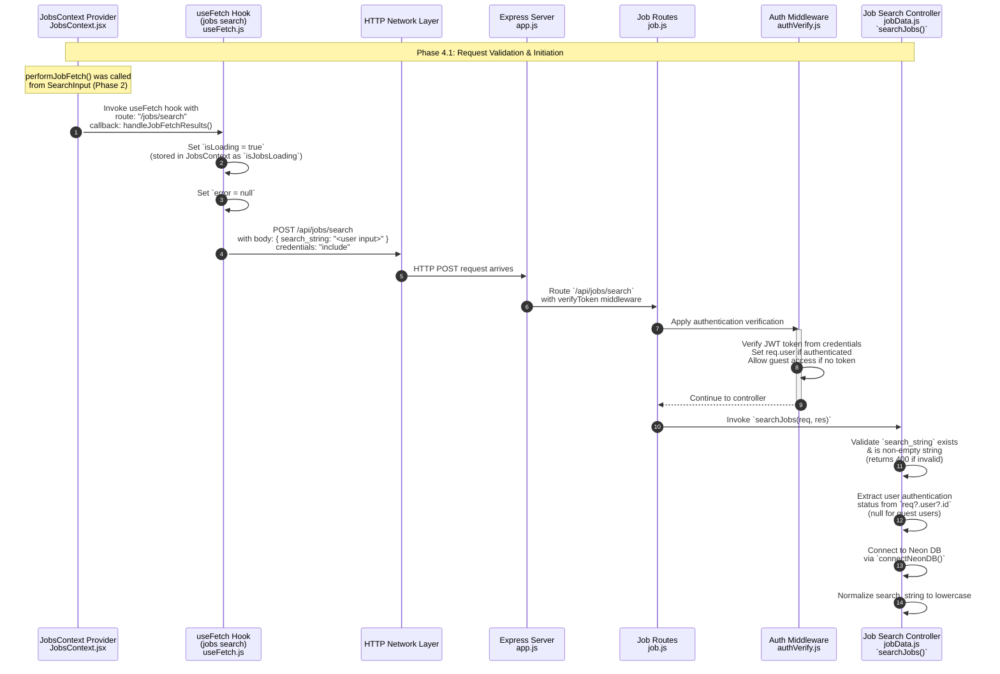

**Phase 4.1: Request Validation & Initiation**

- [← Back to Job Fetch Flowchart](_JobFetchFlowchart.md)
- [← Previous: Phase 3: Navigation](3.Navigation.md)
- [Next → Phase 4.2: Client-Side Error Handling](4.2.Client-Side%20Error%20Handling.md)
- [Alternative → Phase 4.3: Search Processing & Results Aggregation](4.3.Search%20Processing%20&%20Results%20Aggregation.md)

## Technical Implementation Details

### Server-Side Request Validation

The `searchJobs()` controller in `server/src/controllers/jobData.js` performs comprehensive validation:

- **Input Validation**: Ensures `search_string` is a non-empty string
- **Authentication Check**: Extracts user ID from JWT token (`req?.user?.id`)
- **Database Connection**: Establishes connection to Neon PostgreSQL database
- **Cleanup Operations**: Removes stale in-progress search entries using `cleanupInProgress()`

### Request Flow Architecture

1. **Client Request**: POST request sent to `/api/jobs/search` endpoint with credentials
2. **Route Handling**: Express router applies `verifyToken` middleware, then directs to job search controller
3. **Authentication Middleware**: JWT verification via `verifyToken` (sets `req.user` or allows guest access)
4. **Controller Processing**: Business logic execution in `jobData.js`
5. **Database Operations**: Connection pooling and query execution

### Authentication Context

The system distinguishes between:

- **Authenticated Users**: Full access to all job sources, higher result limits, background scraping (req.user.id exists)
- **Guest Users**: Limited access, reduced result counts, no background processing (req.user.id is null)

The `verifyToken` middleware allows guest access while still providing authentication for logged-in users.

### Error Handling Strategy

- Immediate validation failures return 400 status codes
- Database connection issues trigger 500 status codes
- All errors are logged using the centralized logging utility
- Client receives structured error responses for proper handling
