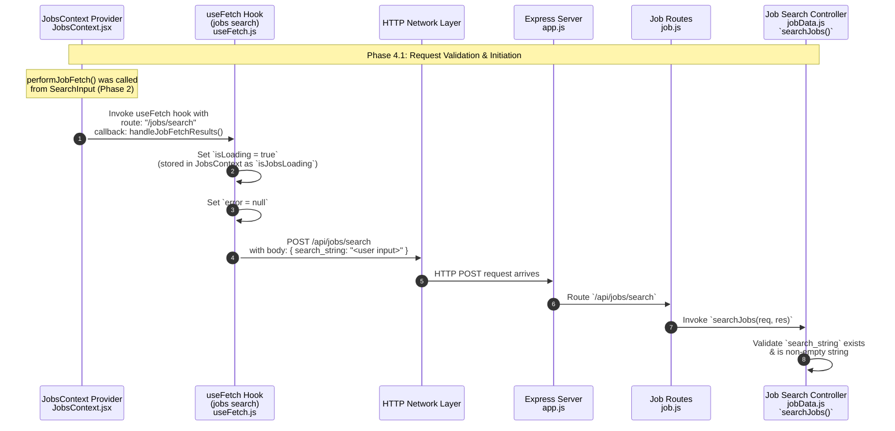

**Phase 4.1: Request Validation & Initiation**

- [← Back to Job Fetch Flowchart](_JobFetchFlowchart.md)
- [← Previous: Phase 3: Navigation](3.Navigation.md)
- [Next → Phase 4.2: Client-Side Error Handling](4.2.Client-Side%20Error%20Handling.md)
- [Alternative → Phase 4.3: Search Processing & Results Aggregation](4.3.Search%20Processing%20&%20Results%20Aggregation.md)

