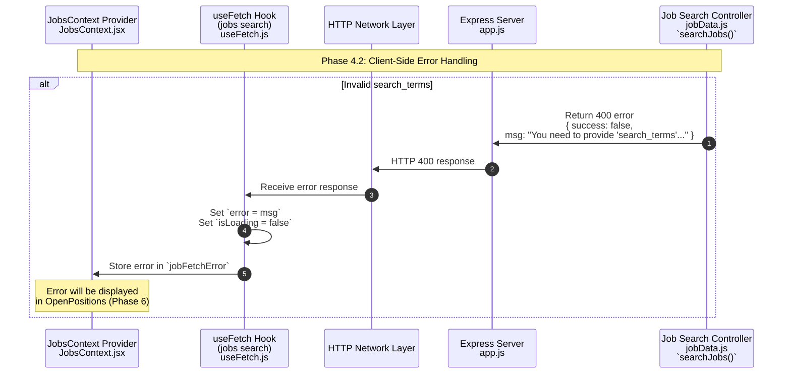

**Phase 4.2: Client-Side Error Handling**

- [← Back to Job Fetch Flowchart](_JobFetchFlowchart.md)
- [← Previous: Phase 4.1: Request Validation & Initiation](4.1.Request%20Validation%20&%20Initiation.md)
- [Next → Phase 6: Display Results](6.Display%20Results.md)

