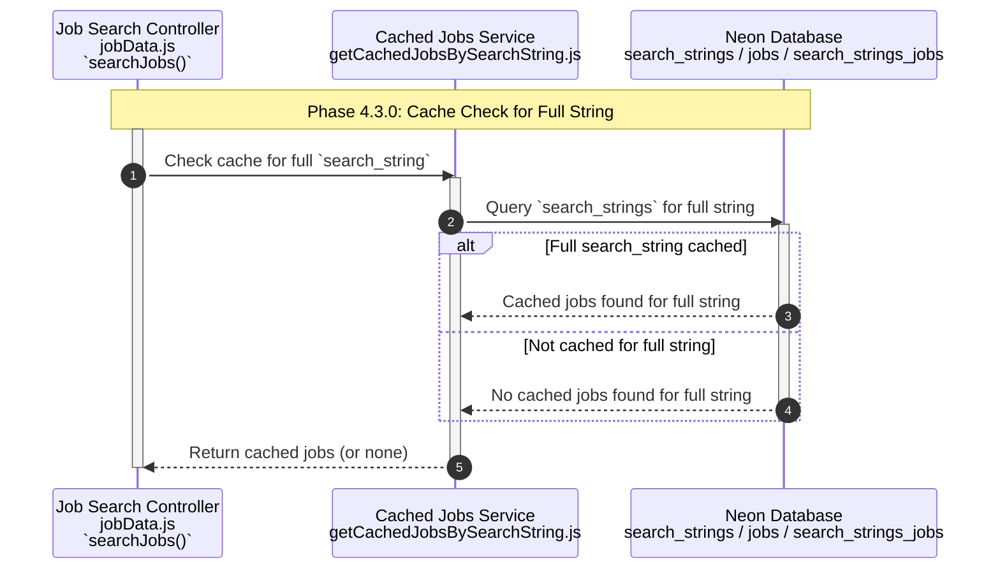

**Phase 4.3.1: Cache Check for Full String**

- [← Back to Search Processing & Results Aggregation](4.3.Search%20Processing%20&%20Results%20Aggregation.md)

```mermaid
sequenceDiagram
    autonumber
    %% File paths:
    %% JobController: server/src/controllers/jobData.js
    %% CachedJobsService: server/src/services/getCachedJobsBySearchString.js
    %% NeonDB: Neon Database
    participant JobController as Job Search Controller<br/>jobData.js<br/>`searchJobs()`
    participant CachedJobsService as Cached Jobs Service<br/>getCachedJobsBySearchString.js
    participant NeonDB as Neon Database<br/>search_strings / jobs / search_strings_jobs

    Note over JobController,NeonDB: Phase 4.3.0: Cache Check for Full String
    activate JobController

    JobController->>CachedJobsService: Check cache for full `search_string`
    activate CachedJobsService
    CachedJobsService->>NeonDB: Query `search_strings` for full string
    activate NeonDB
    alt Full search_string cached
        NeonDB-->>CachedJobsService: Cached jobs found for full string
    else Not cached for full string
        NeonDB-->>CachedJobsService: No cached jobs found for full string
    end
    deactivate NeonDB
    CachedJobsService-->>JobController: Return cached jobs (or none)
    deactivate CachedJobsService
    deactivate JobController
```
