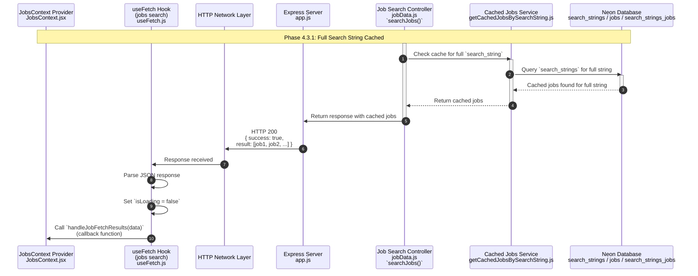

**Phase 4.3.2: Full Search String Cached**

- [← Back to Job Fetch Flowchart](_JobFetchFlowchart.md)
- [← Previous: Phase 4.3.1: Cache Check for Full String](4.3.1.Cache%20Check%20for%20Full%20String.md)
- [Next → Phase 6: Display Results](6.Display%20Results.md)

