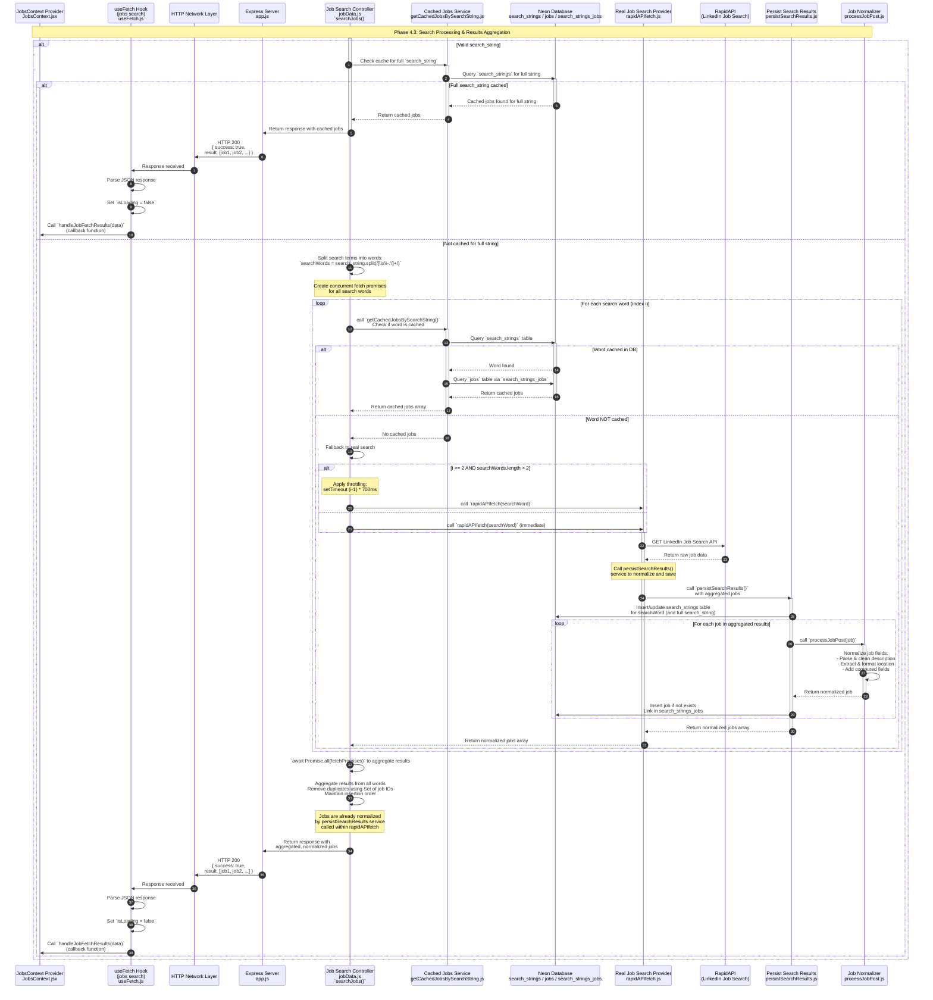

**Phase 4.3: Search Processing & Results Aggregation**

- [← Back to Job Fetch Flowchart](_JobFetchFlowchart.md)
- [← Previous: Phase 4.2: Client-Side Error Handling](4.2.Client-Side%20Error%20Handling.md)
- [Next → Phase 5: Travel Details Fetch](5.Travel%20Details%20Fetch.md)
- [Alternative → Phase 4.4: Server/Network Error Handling](4.4.Server-Network%20Error%20Handling.md)

