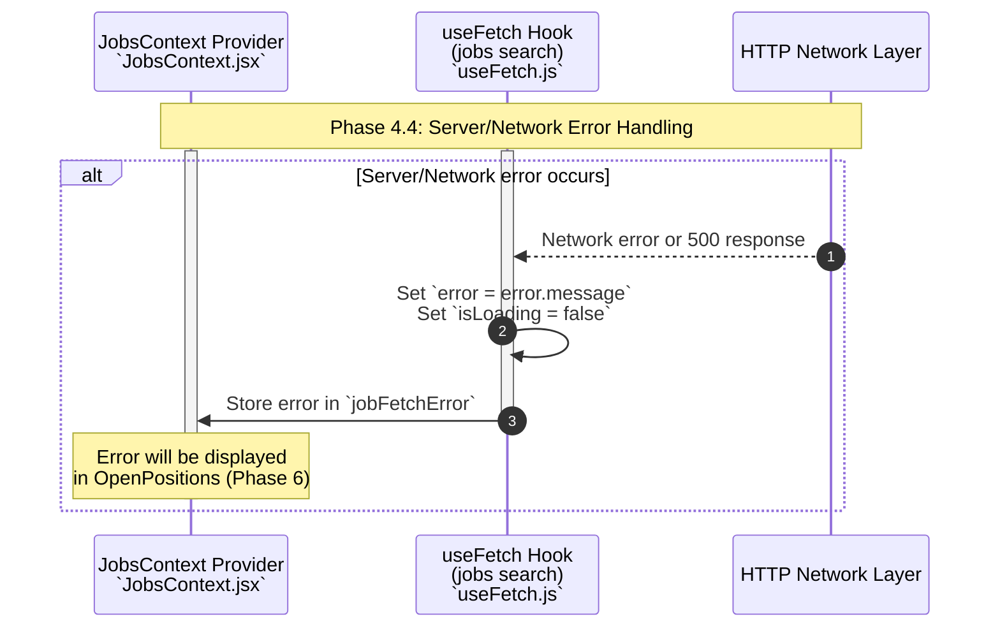

**Phase 4.4: Server/Network Error Handling**

- [← Back to Job Fetch Flowchart](_JobFetchFlowchart.md)
- [← Previous: Phase 4.3: Search Processing & Results Aggregation](4.3.Search%20Processing%20&%20Results%20Aggregation.md)
- [Next → Phase 5: Travel Details Fetch](5.Travel%20Details%20Fetch.md)

