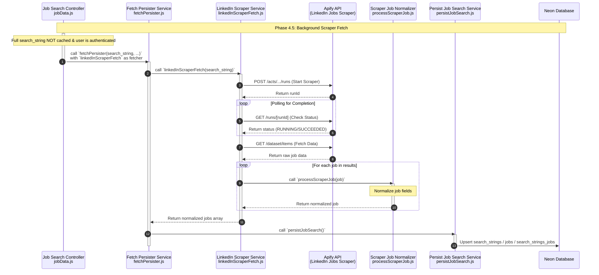

**Phase 4.5: Background Scraper Fetch**

- [← Back to Job Fetch Flowchart](_JobFetchFlowchart.md)
- [← Previous: Phase 4.3.1: Cache Check for Full String](4.3.1.Cache%20Check%20for%20Full%20String.md)
- [Next → Phase 6: Display Results](6.Display%20Results.md)

### Overview

When an authenticated user performs a search for a string that is not fully cached, the system triggers a background task to scrape LinkedIn for the full search string. This provides more comprehensive results in subsequent searches.

### Key Components

- **fetchPersister.js** (`server/src/services/fetchPersister.js`)
  - Handles the asynchronous execution of the fetcher.
  - Ensures the database connection is managed and results are persisted.
  - Deletes the search from `inProgressSearches` once completed.

- **linkedInScraperFetch.js** (`server/src/services/linkedInScraperFetch.js`)
  - Interacts with the Apify API to run the LinkedIn jobs scraper actor.
  - Polls for completion and retrieves the dataset.
  - Normalizes results using `processScraperJob.js`.

- **processScraperJob.js** (`server/src/util/processScraperJob.js`)
  - Normalizes the specific data format returned by the Apify scraper to match the application's internal job schema.

### Background Nature

This process is **non-blocking** for the main job search request. The `JobController` does not `await` the `fetchPersister` call. Instead, it proceeds to return the current (partially cached or RapidAPI-fetched) results to the user immediately. The scraper results will become available in the database for future searches once the background process completes (typically within 5-10 minutes).
