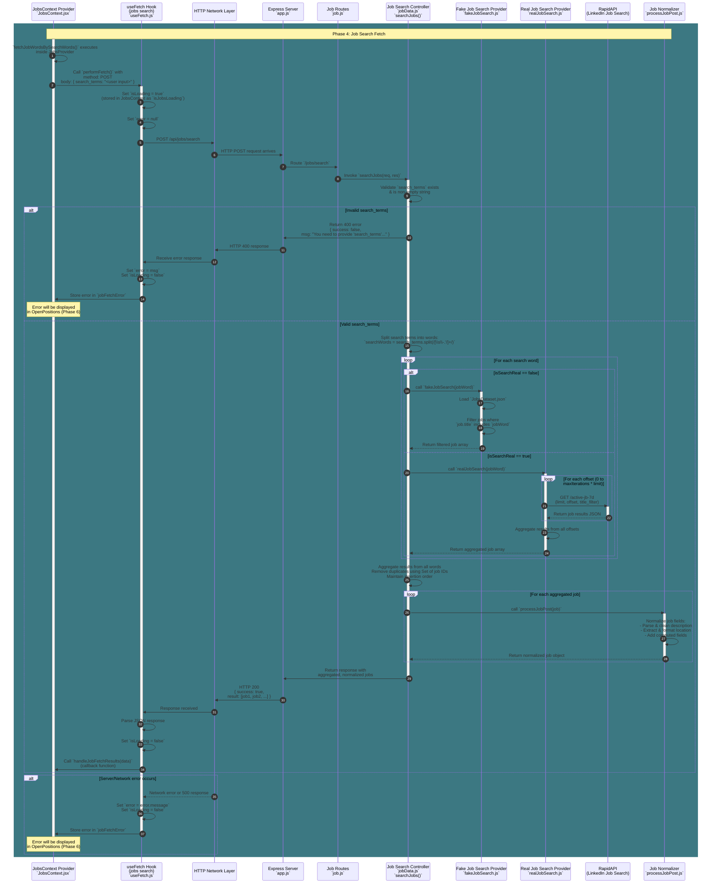

```mermaid
sequenceDiagram
    autonumber
    participant JobsContext as JobsContext Provider<br/>`JobsContext.jsx`
    participant useFetch_1 as useFetch Hook<br/>(jobs search)<br/>`useFetch.js`
    participant FrontendNetwork as HTTP Network Layer
    participant ExpressApp as Express Server<br/>`app.js`
    participant JobRouter as Job Routes<br/>`job.js`
    participant JobController as Job Search Controller<br/>`jobData.js`<br/>`searchJobs()`
    participant FakeJobSearch as Fake Job Search Provider<br/>`fakeJobSearch.js`
    participant RealJobSearch as Real Job Search Provider<br/>`realJobSearch.js`
    participant RapidAPI as RapidAPI<br/>(LinkedIn Job Search)
    participant ProcessJobPost as Job Normalizer<br/>`processJobPost.js`

    rect rgb(60, 120, 130)
    Note over JobsContext,ProcessJobPost: Phase 4: Job Search Fetch
    activate JobsContext
    JobsContext->>JobsContext: `fetchJobWordsBySearchWords()` executes<br/>inside JobsProvider
    JobsContext->>useFetch_1: Call `performFetch()` with<br/>method: POST<br/>body: { search_terms: "<user input>" }

    activate useFetch_1
    useFetch_1->>useFetch_1: Set `isLoading = true`<br/>(stored in JobsContext as `isJobsLoading`)
    useFetch_1->>useFetch_1: Set `error = null`
    useFetch_1->>FrontendNetwork: POST /api/jobs/search

    FrontendNetwork->>ExpressApp: HTTP POST request arrives
    ExpressApp->>JobRouter: Route `/jobs/search`

    JobRouter->>JobController: Invoke `searchJobs(req, res)`

    activate JobController
    JobController->>JobController: Validate `search_terms` exists<br/>& is non-empty string
    
    alt Invalid search_terms
        JobController->>ExpressApp: Return 400 error<br/>{ success: false,<br/>  msg: "You need to provide 'search_terms'..." }
        ExpressApp->>FrontendNetwork: HTTP 400 response
        FrontendNetwork->>useFetch_1: Receive error response
        useFetch_1->>useFetch_1: Set `error = msg`<br/>Set `isLoading = false`
        useFetch_1->>JobsContext: Store error in `jobFetchError`

        Note over JobsContext: Error will be displayed<br/>in OpenPositions (Phase 6)
    else Valid search_terms
        JobController->>JobController: Split search terms into words:<br/>`searchWords = search_terms.split(/[\\s\\-.'/]+/)`

        loop For each search word
            alt isSearchReal == false
                JobController->>FakeJobSearch: call `fakeJobSearch(jobWord)`
                activate FakeJobSearch
                FakeJobSearch->>FakeJobSearch: Load `JobsDataset.json`
                FakeJobSearch->>FakeJobSearch: Filter jobs where<br/>`job.title` includes `jobWord`
                FakeJobSearch-->>JobController: Return filtered job array
                deactivate FakeJobSearch
            else isSearchReal == true
                JobController->>RealJobSearch: call `realJobSearch(jobWord)`
                activate RealJobSearch
                loop For each offset (0 to maxIterations * limit)
                    RealJobSearch->>RapidAPI: GET /active-jb-7d<br/>(limit, offset, title_filter)
                    activate RapidAPI
                    RapidAPI-->>RealJobSearch: Return job results JSON
                    deactivate RapidAPI
                end
                RealJobSearch->>RealJobSearch: Aggregate results from all offsets
                RealJobSearch-->>JobController: Return aggregated job array
                deactivate RealJobSearch
            end
        end

        JobController->>JobController: Aggregate results from all words<br/>Remove duplicates using Set of job IDs<br/>Maintain insertion order

        loop For each aggregated job
            JobController->>ProcessJobPost: call `processJobPost(job)`
            activate ProcessJobPost
            ProcessJobPost->>ProcessJobPost: Normalize job fields:<br/>- Parse & clean description<br/>- Extract & format location<br/>- Add computed fields
            ProcessJobPost-->>JobController: Return normalized job object
            deactivate ProcessJobPost
        end

        JobController->>ExpressApp: Return response with<br/>aggregated, normalized jobs
        deactivate JobController
        ExpressApp->>FrontendNetwork: HTTP 200<br/>{ success: true,<br/>  result: [job1, job2, ...] }
        FrontendNetwork->>useFetch_1: Response received
        useFetch_1->>useFetch_1: Parse JSON response
        useFetch_1->>useFetch_1: Set `isLoading = false`
        useFetch_1->>JobsContext: Call `handleJobFetchResults(data)`<br/>(callback function)
    end

    alt Server/Network error occurs
        FrontendNetwork-->>useFetch_1: Network error or 500 response
        useFetch_1->>useFetch_1: Set `error = error.message`<br/>Set `isLoading = false`
        useFetch_1->>JobsContext: Store error in `jobFetchError`
        deactivate useFetch_1
        Note over JobsContext: Error will be displayed<br/>in OpenPositions (Phase 6)
        deactivate JobsContext
    end

    end
```
