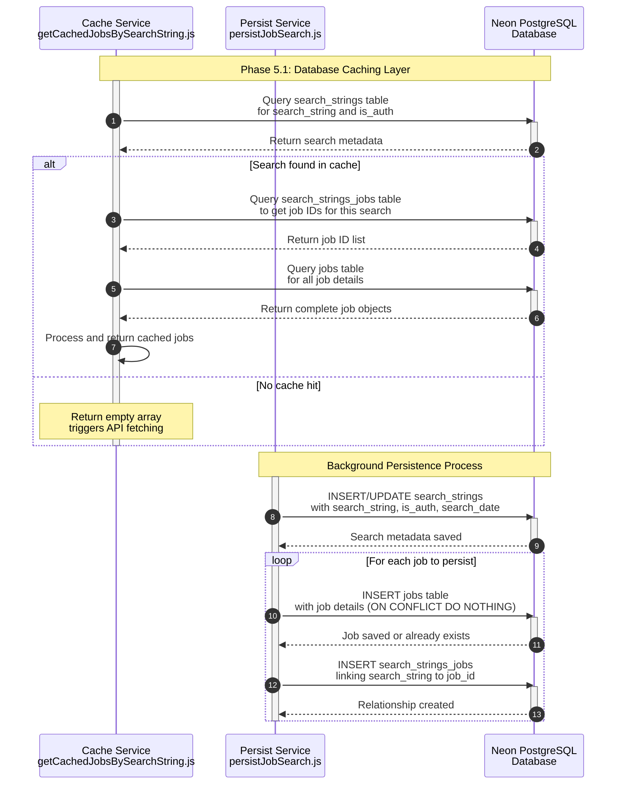

**Phase 5.1: Database Caching Layer**

- [← Back to Job Fetch Flowchart](_JobFetchFlowchart.md)
- [← Previous: Phase 4.3: Search Processing & Results Aggregation](4.3.Search%20Processing%20&%20Results%20Aggregation.md)
- [Next → Phase 6: Response Delivery](6.Response%20Delivery.md)

## Technical Implementation Details

### Database Schema Overview

#### Core Tables

- **`search_strings`**: Tracks search queries with authentication context
- **`jobs`**: Stores normalized job data from all sources
- **`search_strings_jobs`**: Many-to-many relationship linking searches to results
- **`users`**: User account information and preferences
- **`user_favorites`**: User-saved jobs with commute data

#### Cache Retrieval Logic (`getCachedJobsBySearchString.js`)

1. **Search Metadata Lookup**: Checks if search string exists for current auth context
2. **Job ID Retrieval**: Gets all job IDs associated with the search
3. **Job Data Assembly**: Fetches complete job objects for all IDs
4. **Result Processing**: Returns formatted job array or empty result

#### Persistence Logic (`persistJobSearch.js`)

1. **Search Registration**: Creates/updates search string record with timestamp
2. **Job Storage**: Inserts jobs with conflict resolution (no duplicates)
3. **Relationship Mapping**: Links jobs to search strings for future retrieval
4. **Transaction Management**: Ensures data consistency across operations

### Caching Strategy

#### Authentication-Based Caching

- **Authenticated Users**: Separate cache namespace with full result sets
- **Guest Users**: Limited cache with reduced result sets
- **Cache Isolation**: Different auth contexts never share cached results

#### Cache Invalidation

- **Time-Based**: Daily cleanup removes entries older than configured threshold
- **Manual Cleanup**: Administrative functions for cache management
- **Automatic Maintenance**: Cron jobs optimize database performance

### Database Performance Optimizations

#### Indexing Strategy

- **Primary Keys**: Optimized for lookups on all tables
- **Foreign Keys**: Indexed for fast join operations
- **Search Indexes**: Optimized for common query patterns
- **Composite Indexes**: Multi-column indexes for complex queries

#### Query Optimization

- **Prepared Statements**: Parameterized queries for security and performance
- **Connection Pooling**: Efficient database connection management
- **Batch Operations**: Bulk inserts for better performance
- **Query Planning**: Optimized SQL execution paths

### Data Normalization

#### Job Data Standardization

- **Field Mapping**: Consistent field names across API sources
- **Value Normalization**: Standardized enums for employment types, seniority levels
- **Location Processing**: Normalized location formatting
- **Description Handling**: Text normalization and search optimization

#### Search String Processing

- **Case Normalization**: Lowercase storage for consistent matching
- **Whitespace Handling**: Normalized spacing and special characters
- **Encoding Support**: UTF-8 support for international characters

### Error Handling & Recovery

#### Database Connection Issues

- **Retry Logic**: Automatic reconnection attempts
- **Connection Pooling**: Graceful handling of connection limits
- **Fallback Behavior**: Degrades gracefully when database unavailable
- **Error Logging**: Comprehensive error tracking and monitoring

#### Data Integrity

- **Transaction Management**: ACID compliance for critical operations
- **Constraint Validation**: Database-level data validation
- **Conflict Resolution**: Upsert logic for duplicate prevention
- **Rollback Handling**: Automatic rollback on failed operations

### Monitoring & Analytics

#### Performance Metrics

- **Cache Hit Rates**: Track effectiveness of caching strategy
- **Query Performance**: Monitor slow queries and optimization opportunities
- **Database Load**: Track connection usage and resource consumption
- **API Integration**: Monitor external API success rates and response times

#### Data Analytics

- **Search Patterns**: Analyze popular search terms and user behavior
- **Source Effectiveness**: Track which APIs provide the most relevant results
- **User Engagement**: Monitor cache usage and search result quality
- **System Health**: Overall database and application performance metrics
