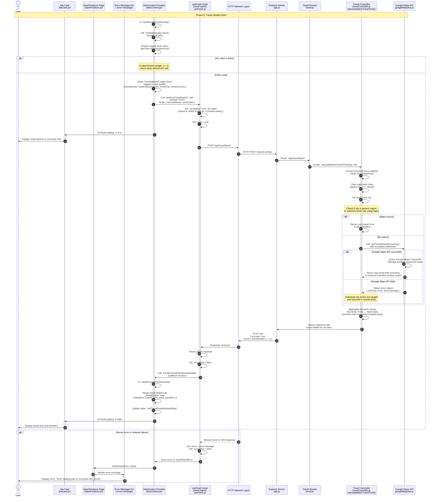

**Phase 5: Travel Details Fetch**

- [← Back to Job Fetch Flowchart](_JobFetchFlowchart.md)
- [← Previous: Multiple paths from search success] - [Phase 4.3.2: Full Search String Cached](4.3.2.Full%20Search%20String%20Cached.md) - [Phase 4.3.3: Not Cached for Full String](4.3.3.Not%20Cached%20for%20Full%20String.md)
- [Next → Phase 6: Display Results](6.Display%20Results.md)

