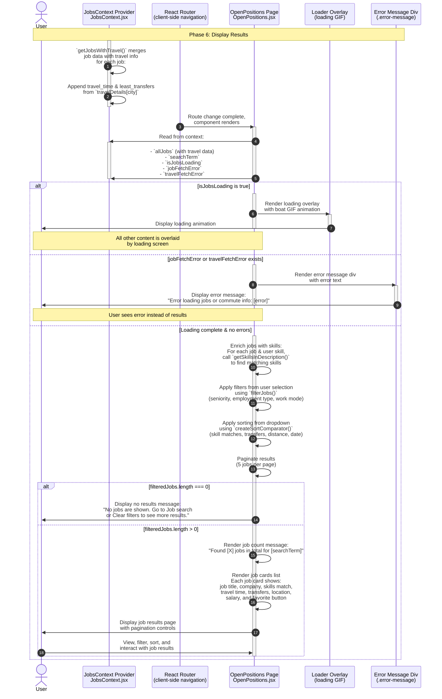

**Phase 6: Display Results**

- [← Back to Job Fetch Flowchart](_JobFetchFlowchart.md)
- [← Previous: Phase 5: Travel Details Fetch](5.Travel%20Details%20Fetch.md)
- [Next] - (This is the final phase)

