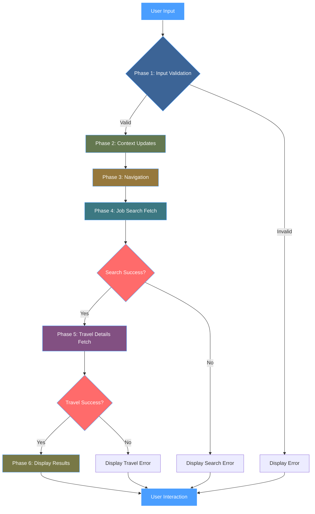

```mermaid
flowchart TD
    A[User Input] --> B{Phase 1: Input Validation}
    B -->|Valid| C[Phase 2: Context Updates]
    B -->|Invalid| Z[Display Error]
    C --> D[Phase 3: Navigation]
    D --> E[Phase 4: Job Search Fetch]
    E --> F{Search Success?}
    F -->|Yes| G[Phase 5: Travel Details Fetch]
    F -->|No| H[Display Search Error]
    G --> I{Travel Success?}
    I -->|Yes| J[Phase 6: Display Results]
    I -->|No| K[Display Travel Error]
    J --> L[User Interaction]
    H --> L
    K --> L
    Z --> L

    style A fill:#4a9eff,stroke:#fff,color:#fff
    style B fill:#3c6496,stroke:#4a9eff,color:#fff
    style C fill:#647850,stroke:#4a9eff,color:#fff
    style D fill:#96783c,stroke:#4a9eff,color:#fff
    style E fill:#3c7882,stroke:#4a9eff,color:#fff
    style F fill:#ff6b6b,stroke:#4a9eff,color:#fff
    style G fill:#825082,stroke:#4a9eff,color:#fff
    style I fill:#ff6b6b,stroke:#4a9eff,color:#fff
    style J fill:#787846,stroke:#4a9eff,color:#fff
    style L fill:#4a9eff,stroke:#fff,color:#fff
```