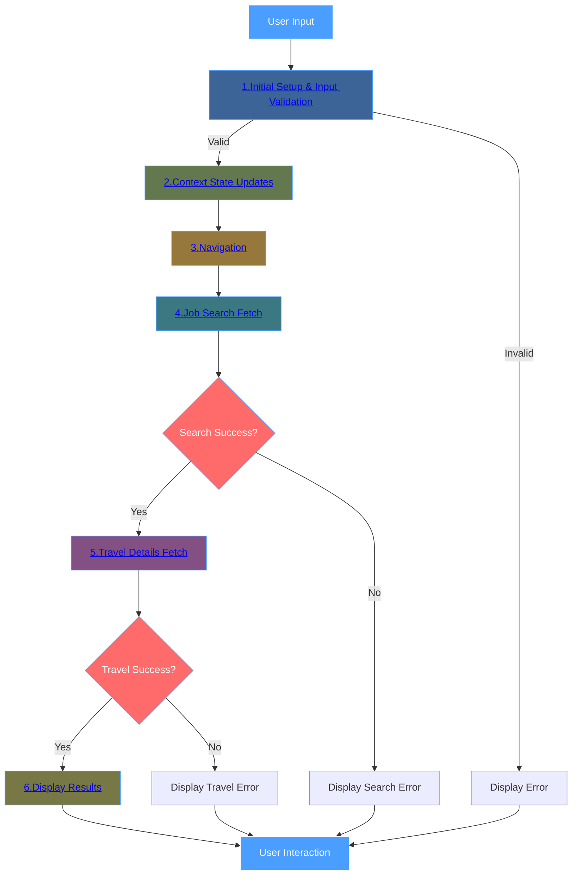

## Phase Documentation
- [1.Initial Setup & Input Validation.md](./1.Initial%20Setup%20&%20Input%20Validation.md)
- [2.Context State Updates.md](./2.Context%20State%20Updates.md)
- [3.Navigation.md](./3.Navigation.md)
- [4.Job Search Fetch.md](./4.Job%20Search%20Fetch.md)
- [5.Travel Details Fetch.md](./5.Travel%20Details%20Fetch.md)
- [6.Display Results.md](./6.Display%20Results.md)
