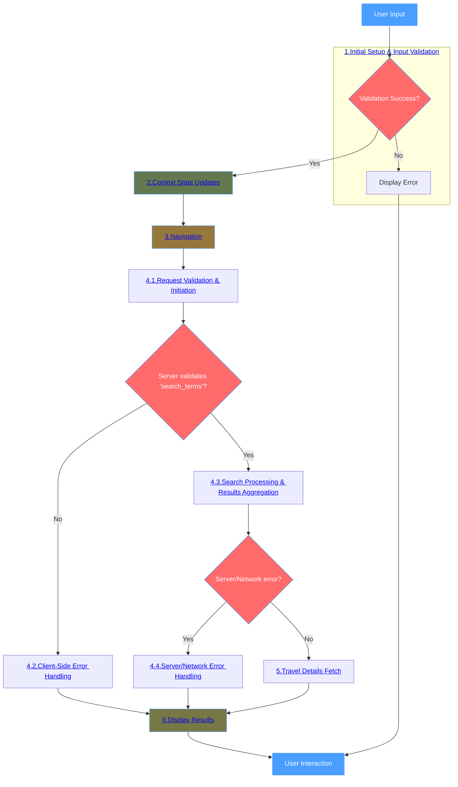

```mermaid
flowchart TD
    A[User Input] --> B{Validation Success?}
    subgraph Validation["<a href='./1.Initial%20Setup%20&%20Input%20Validation.md'>1.Initial Setup & Input Validation</a>"]
    B -->|No| J[Display Error]
    end
    B -->|Yes| C["<a href='./2.Context%20State%20Updates.md'>2.Context State Updates</a>"]
    C --> D["<a href='./3.Navigation.md'>3.Navigation</a>"]

    D --> E1["<a href='./4.1.Request%20Validation%20&%20Initiation.md'>4.1.Request Validation & Initiation</a>"]
    E1 --> F{Server validates 'search_terms'?}
    F -->|No| X["<a href='./4.2.Client-Side%20Error%20Handling.md'>4.2.Client-Side Error Handling</a>"]
    F -->|Yes| G1["<a href='./4.3.Search%20Processing%20&%20Results%20Aggregation.md'>4.3.Search Processing & Results Aggregation</a>"]

    G1 --> H{Server/Network error?}
    H -->|Yes| Y["<a href='./4.4.Server-Network%20Error%20Handling.md'>4.4.Server/Network Error Handling</a>"]
    H -->|No| T["<a href='./5.Travel%20Details%20Fetch.md'>5.Travel Details Fetch</a>"]

    X --> I["<a href='./6.Display%20Results.md'>6.Display Results</a>"]
    Y --> I
    T --> I
    I --> K[User Interaction]
    J --> K

    style A fill:#4a9eff,stroke:#fff,color:#fff
    style B fill:#ff6b6b,stroke:#4a9eff,color:#fff
    style C fill:#647850,stroke:#4a9eff,color:#fff
    style D fill:#96783c,stroke:#4a9eff,color:#fff
    style F fill:#ff6b6b,stroke:#4a9eff,color:#fff
    style H fill:#ff6b6b,stroke:#4a9eff,color:#fff
    style I fill:#787846,stroke:#4a9eff,color:#fff
    style K fill:#4a9eff,stroke:#fff,color:#fff
```
