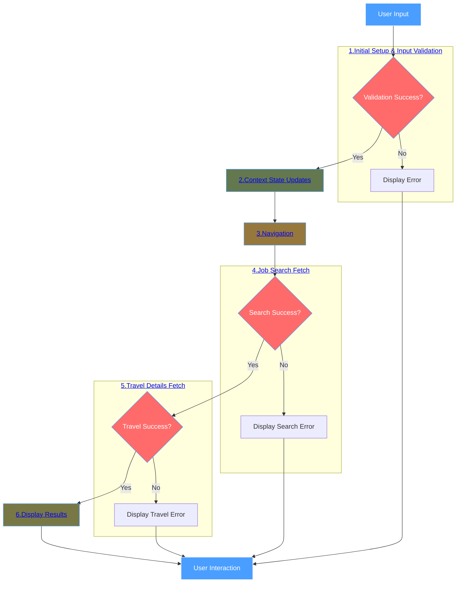

```mermaid
flowchart TD
    A[User Input] --> B{Validation Success?}
    subgraph Validation["<a href='./1.Initial%20Setup%20&%20Input%20Validation.md'>1.Initial Setup & Input Validation</a>"]
    B -->|No| J[Display Error]
    end
    B -->|Yes| C["<a href='./2.Context%20State%20Updates.md'>2.Context State Updates</a>"]
    C --> D["<a href='./3.Navigation.md'>3.Navigation</a>"]
    D --> E{Search Success?}
    subgraph JobSearch["<a href='./4.Job%20Search%20Fetch.md'>4.Job Search Fetch</a>"]
    E -->|No| F[Display Search Error]
    end
    E -->|Yes| G{Travel Success?}
    subgraph TravelDetails["<a href='./5.Travel%20Details%20Fetch.md'>5.Travel Details Fetch</a>"]
    G -->|No| H[Display Travel Error]
    end
    G -->|Yes| I["<a href='./6.Display%20Results.md'>6.Display Results</a>"]
    I --> K[User Interaction]
    F --> K
    H --> K
    J --> K

    style A fill:#4a9eff,stroke:#fff,color:#fff
    style B fill:#ff6b6b,stroke:#4a9eff,color:#fff
    style C fill:#647850,stroke:#4a9eff,color:#fff
    style D fill:#96783c,stroke:#4a9eff,color:#fff
    style E fill:#ff6b6b,stroke:#4a9eff,color:#fff
    style G fill:#ff6b6b,stroke:#4a9eff,color:#fff
    style I fill:#787846,stroke:#4a9eff,color:#fff
    style K fill:#4a9eff,stroke:#fff,color:#fff
```