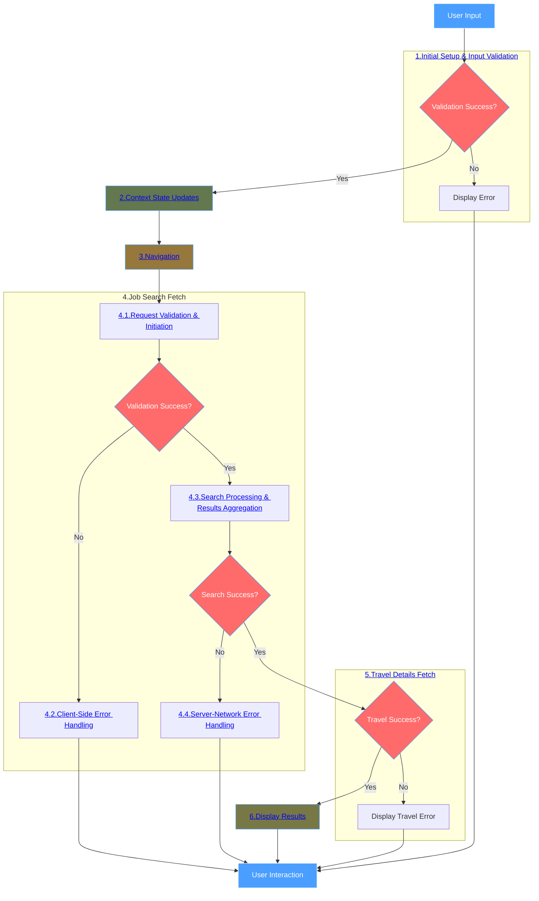

```mermaid
flowchart TD
    A[User Input] --> B{Validation Success?}
    subgraph Validation["<a href='./1.Initial%20Setup%20&%20Input%20Validation.md'>1.Initial Setup & Input Validation</a>"]
    B -->|No| C[Display Error]
    end
    B -->|Yes| D["<a href='./2.Context%20State%20Updates.md'>2.Context State Updates</a>"]
    D --> E["<a href='./3.Navigation.md'>3.Navigation</a>"]
    E --> F["<a href='./4.1.Request%20Validation%20&%20Initiation.md'>4.1.Request Validation & Initiation</a>"]
    subgraph JobSearch[4.Job Search Fetch]
    F --> G{Validation Success?}
    G -->|No| H["<a href='./4.2.Client-Side%20Error%20Handling.md'>4.2.Client-Side Error Handling</a>"]
    L -->|No| J["<a href='./4.4.Server-Network%20Error%20Handling.md'>4.4.Server-Network Error Handling</a>"]
    G -->|Yes| K["<a href='./4.3.Search%20Processing%20&%20Results%20Aggregation.md'>4.3.Search Processing & Results Aggregation</a>"]
    K --> L{Search Success?}
    end
    H -->P[User Interaction]
    J -->P
    L -->|Yes| M{Travel Success?}
    subgraph TravelDetails["<a href='./5.Travel%20Details%20Fetch.md'>5.Travel Details Fetch</a>"]
    M -->|No| N[Display Travel Error]
    end
    M -->|Yes| O["<a href='./6.Display%20Results.md'>6.Display Results</a>"]
    O --> P[User Interaction]
    N --> P
    C --> P

    style A fill:#4a9eff,stroke:#fff,color:#fff
    style B fill:#ff6b6b,stroke:#4a9eff,color:#fff
    style D fill:#647850,stroke:#4a9eff,color:#fff
    style E fill:#96783c,stroke:#4a9eff,color:#fff
    style G fill:#ff6b6b,stroke:#4a9eff,color:#fff
    style M fill:#ff6b6b,stroke:#4a9eff,color:#fff
    style O fill:#787846,stroke:#4a9eff,color:#fff
    style P fill:#4a9eff,stroke:#fff,color:#fff
    style L fill:#ff6b6b,stroke:#4a9eff,color:#fff
```
