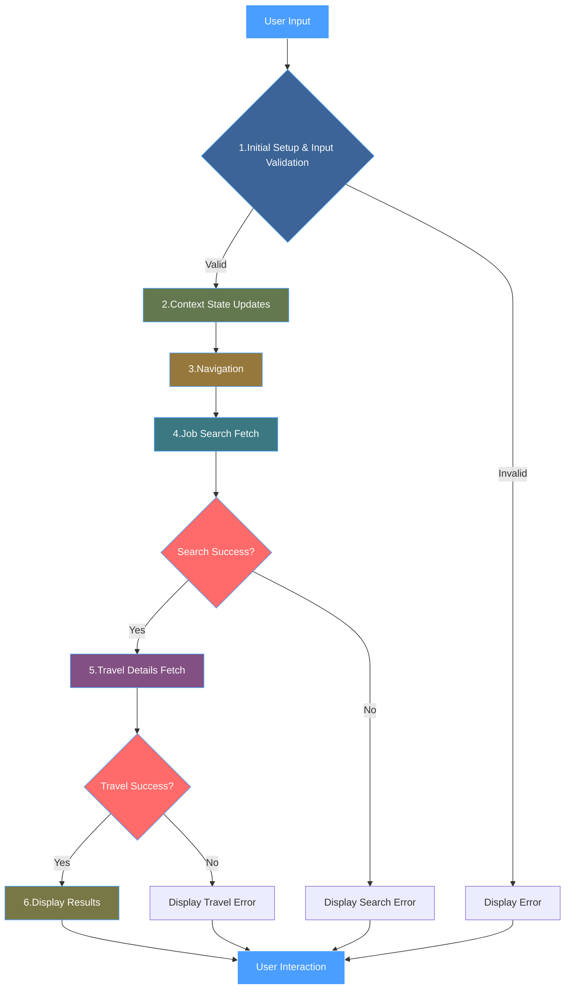

```mermaid
flowchart TD
    A[User Input] --> B{1.Initial Setup & Input Validation}
    B -->|Valid| C[2.Context State Updates]
    B -->|Invalid| Z[Display Error]
    C --> D[3.Navigation]
    D --> E[4.Job Search Fetch]
    E --> F{Search Success?}
    F -->|Yes| G[5.Travel Details Fetch]
    F -->|No| H[Display Search Error]
    G --> I{Travel Success?}
    I -->|Yes| J[6.Display Results]
    I -->|No| K[Display Travel Error]
    J --> L[User Interaction]
    H --> L
    K --> L
    Z --> L

    style A fill:#4a9eff,stroke:#fff,color:#fff
    style B fill:#3c6496,stroke:#4a9eff,color:#fff
    style C fill:#647850,stroke:#4a9eff,color:#fff
    style D fill:#96783c,stroke:#4a9eff,color:#fff
    style E fill:#3c7882,stroke:#4a9eff,color:#fff
    style F fill:#ff6b6b,stroke:#4a9eff,color:#fff
    style G fill:#825082,stroke:#4a9eff,color:#fff
    style I fill:#ff6b6b,stroke:#4a9eff,color:#fff
    style J fill:#787846,stroke:#4a9eff,color:#fff
    style L fill:#4a9eff,stroke:#fff,color:#fff

    click B "./1.Initial%20Setup%20&%20Input%20Validation.md" "View Phase 1 Details"
    click C "./2.Context%20State%20Updates.md" "View Phase 2 Details"
    click D "./3.Navigation.md" "View Phase 3 Details"
    click E "./4.Job%20Search%20Fetch.md" "View Phase 4 Details"
    click G "./5.Travel%20Details%20Fetch.md" "View Phase 5 Details"
    click J "./6.Display%20Results.md" "View Phase 6 Details"
```
