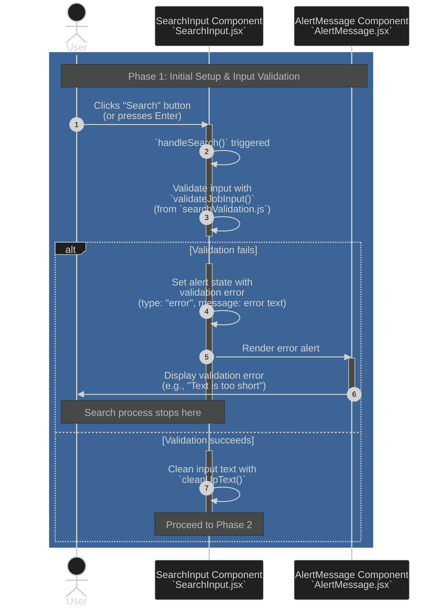

```mermaid
%%{init: {'theme': 'dark', 'themeVariables': { 'primaryColor':'#1a1a1a', 'primaryBorderColor':'#4a9eff', 'lineColor':'#4a9eff', 'tertiaryColor':'#2a2a2a', 'tertiaryBorderColor':'#4a9eff', 'tertiaryTextColor':'#ffffff'}, 'sequence': {'actorMargin': 50}}}%%
sequenceDiagram
    autonumber
    actor User
    participant SearchInput as SearchInput Component<br/>`SearchInput.jsx`
    participant AlertMessage as AlertMessage Component<br/>`AlertMessage.jsx`

    rect rgb(60, 100, 150)
    Note over User,AlertMessage: Phase 1: Initial Setup & Input Validation
    User->>SearchInput: Clicks "Search" button<br/>(or presses Enter)
    activate SearchInput
    SearchInput->>SearchInput: `handleSearch()` triggered
    SearchInput->>SearchInput: Validate input with<br/>`validateJobInput()`<br/>(from `searchValidation.js`)
    deactivate SearchInput
    
    alt Validation fails
        activate SearchInput
        SearchInput->>SearchInput: Set alert state with<br/>validation error<br/>(type: "error", message: error text)
        SearchInput->>AlertMessage: Render error alert
        activate AlertMessage
        AlertMessage->>User: Display validation error<br/>(e.g., "Text is too short")
        deactivate AlertMessage
        Note over SearchInput,User: Search process stops here
        deactivate SearchInput
    else Validation succeeds
        activate SearchInput
        SearchInput->>SearchInput: Clean input text with<br/>`cleanUpText()`
        Note over SearchInput: Proceed to Phase 2
        deactivate SearchInput
    end
    end
```