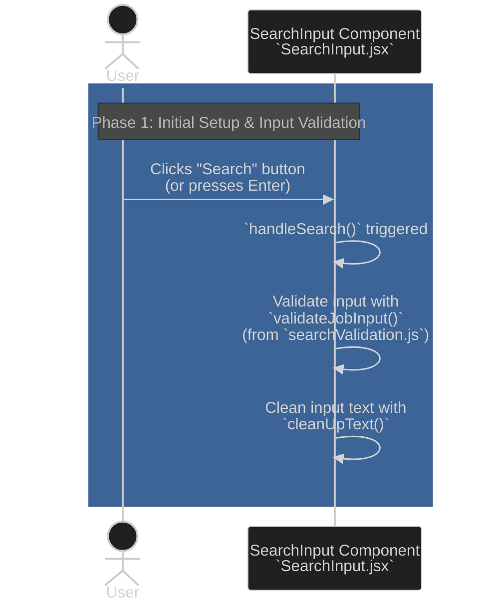

```mermaid
%%{init: {'theme': 'dark', 'themeVariables': { 'primaryColor':'#1a1a1a', 'primaryBorderColor':'#4a9eff', 'lineColor':'#4a9eff', 'tertiaryColor':'#2a2a2a', 'tertiaryBorderColor':'#4a9eff', 'tertiaryTextColor':'#ffffff'}, 'sequence': {'actorMargin': 50}}}%%
sequenceDiagram
    actor User
    participant SearchInput as SearchInput Component<br/>`SearchInput.jsx`

    rect rgb(60, 100, 150)
    Note over User,SearchInput: Phase 1: Initial Setup & Input Validation
    User->>SearchInput: Clicks "Search" button<br/>(or presses Enter)
    SearchInput->>SearchInput: `handleSearch()` triggered
    SearchInput->>SearchInput: Validate input with<br/>`validateJobInput()`<br/>(from `searchValidation.js`)
    SearchInput->>SearchInput: Clean input text with<br/>`cleanUpText()`
    end
```