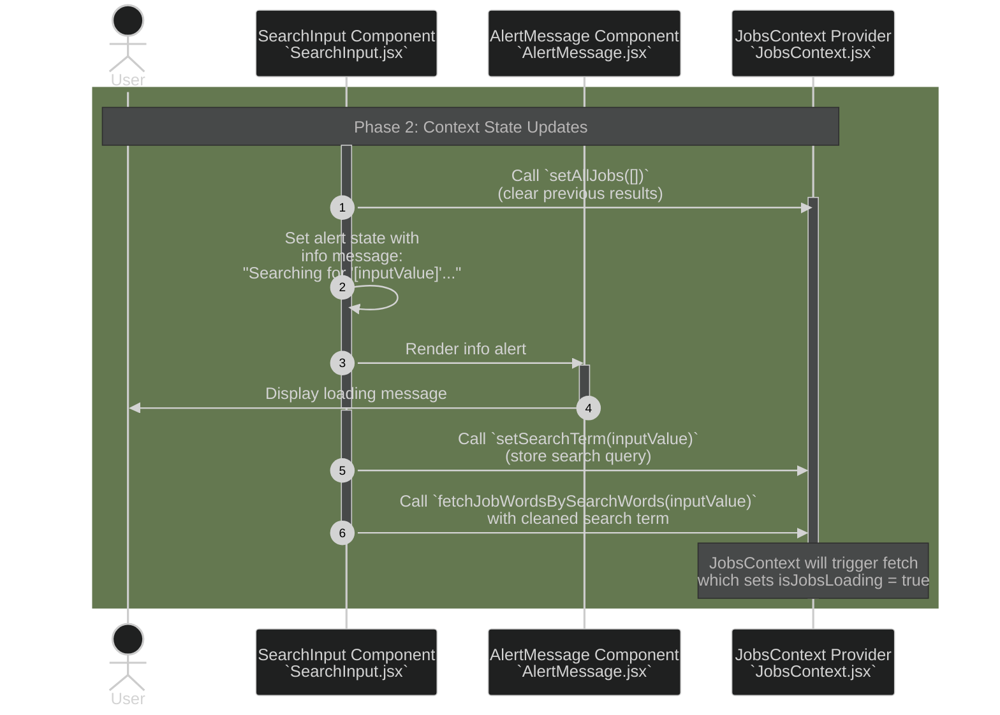

```mermaid
%%{init: {'theme': 'dark', 'themeVariables': { 'primaryColor':'#1a1a1a', 'primaryBorderColor':'#4a9eff', 'lineColor':'#4a9eff', 'tertiaryColor':'#2a2a2a', 'tertiaryBorderColor':'#4a9eff', 'tertiaryTextColor':'#ffffff'}, 'sequence': {'actorMargin': 50}}}%%
sequenceDiagram
    autonumber
    actor User
    participant SearchInput as SearchInput Component<br/>`SearchInput.jsx`
    participant AlertMessage as AlertMessage Component<br/>`AlertMessage.jsx`
    participant JobsContext as JobsContext Provider<br/>`JobsContext.jsx`

    rect rgb(100, 120, 80)
    Note over User,JobsContext: Phase 2: Context State Updates
    activate SearchInput
    SearchInput->>JobsContext: Call `setAllJobs([])`<br/>(clear previous results)
    activate JobsContext
    deactivate SearchInput

    activate SearchInput
    SearchInput->>SearchInput: Set alert state with<br/>info message:<br/>"Searching for '[inputValue]'..."
    SearchInput->>AlertMessage: Render info alert
    activate AlertMessage
    AlertMessage->>User: Display loading message
    deactivate AlertMessage
    deactivate SearchInput

    activate SearchInput
    SearchInput->>JobsContext: Call `setSearchTerm(inputValue)`<br/>(store search query)
    deactivate SearchInput

    activate SearchInput
    SearchInput->>JobsContext: Call `fetchJobWordsBySearchWords(inputValue)`<br/>with cleaned search term
    deactivate SearchInput

    Note over JobsContext: JobsContext will trigger fetch<br/>which sets isJobsLoading = true
    deactivate JobsContext
    end
```