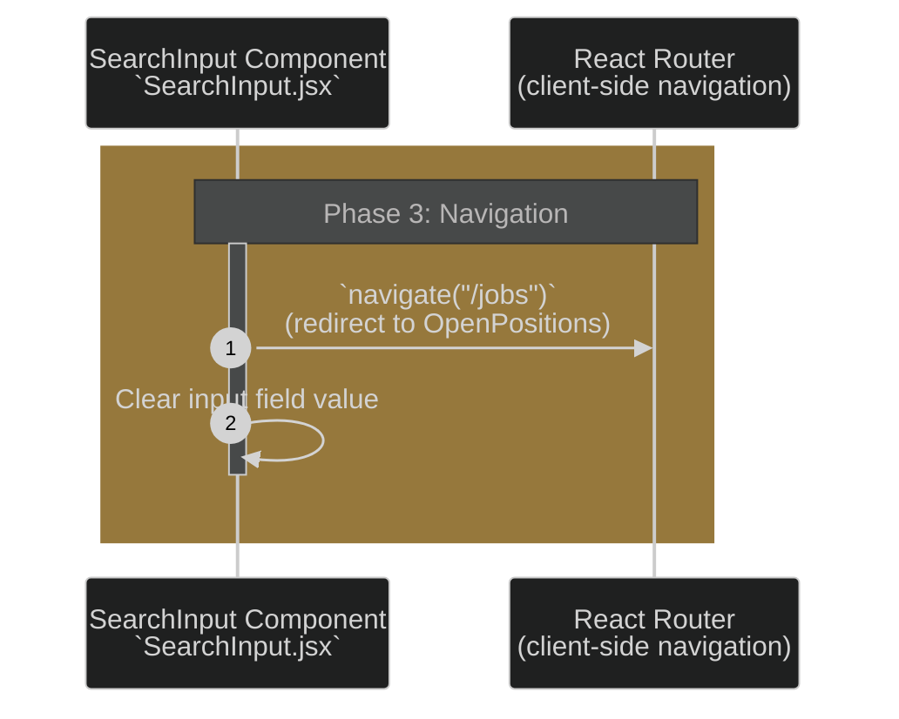

```mermaid
%%{init: {'theme': 'dark', 'themeVariables': { 'primaryColor':'#1a1a1a', 'primaryBorderColor':'#4a9eff', 'lineColor':'#4a9eff', 'tertiaryColor':'#2a2a2a', 'tertiaryBorderColor':'#4a9eff', 'tertiaryTextColor':'#ffffff'}, 'sequence': {'actorMargin': 50}}}%%
sequenceDiagram
    autonumber
    participant SearchInput as SearchInput Component<br/>`SearchInput.jsx`
    participant Router as React Router<br/>(client-side navigation)

    rect rgb(150, 120, 60)
    Note over SearchInput,Router: Phase 3: Navigation
    activate SearchInput
    SearchInput->>Router: `navigate("/jobs")`<br/>(redirect to OpenPositions)
    SearchInput->>SearchInput: Clear input field value
    deactivate SearchInput
    end
```
