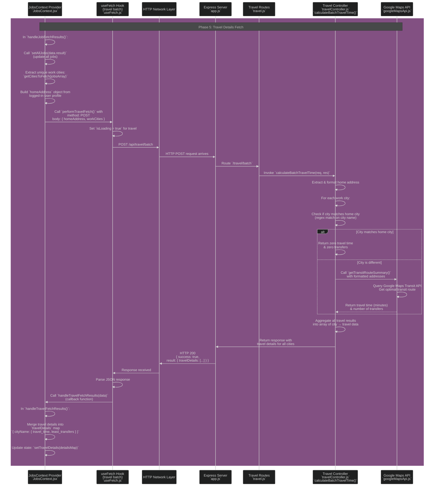

```mermaid
%%{init: {'theme': 'dark', 'themeVariables': { 'primaryColor':'#1a1a1a', 'primaryBorderColor':'#4a9eff', 'lineColor':'#4a9eff', 'tertiaryColor':'#2a2a2a', 'tertiaryBorderColor':'#4a9eff', 'tertiaryTextColor':'#ffffff'}, 'sequence': {'actorMargin': 50}}}%%
sequenceDiagram
    participant JobsContext as JobsContext Provider<br/>`JobsContext.jsx`
    participant useFetch_2 as useFetch Hook<br/>(travel batch)<br/>`useFetch.js`
    participant FrontendNetwork as HTTP Network Layer
    participant ExpressApp as Express Server<br/>`app.js`
    participant TravelRouter as Travel Routes<br/>`travel.js`
    participant TravelController as Travel Controller<br/>`travelController.js`<br/>`calculateBatchTravelTime()`
    participant GoogleMapsAPI as Google Maps API<br/>`googleMapsApi.js`

    rect rgb(130, 80, 130)
    Note over JobsContext,GoogleMapsAPI: Phase 5: Travel Details Fetch
    JobsContext->>JobsContext: In `handleJobFetchResults()`:
    JobsContext->>JobsContext: Call `setAllJobs(data.result)`<br/>(update all jobs)
    JobsContext->>JobsContext: Extract unique work cities:<br/>`getCitiesToFetch(jobsArray)`
    JobsContext->>JobsContext: Build `homeAddress` object from<br/>logged-in user profile

    JobsContext->>useFetch_2: Call `performTravelFetch()` with<br/>method: POST<br/>body: { homeAddress, workCities }

    useFetch_2->>useFetch_2: Set `isLoading = true` for travel
    useFetch_2->>FrontendNetwork: POST /api/travel/batch

    FrontendNetwork->>ExpressApp: HTTP POST request arrives
    ExpressApp->>TravelRouter: Route `/travel/batch`

    TravelRouter->>TravelController: Invoke `calculateBatchTravelTime(req, res)`

    TravelController->>TravelController: Extract & format home address
    TravelController->>TravelController: For each work city:
    TravelController->>TravelController: Check if city matches home city<br/>(regex match on city name)
    alt City matches home city
        TravelController->>TravelController: Return zero travel time<br/>& zero transfers
    else City is different
        TravelController->>GoogleMapsAPI: Call `getTransitRouteSummary()`<br/>with formatted addresses
        GoogleMapsAPI->>GoogleMapsAPI: Query Google Maps Transit API<br/>Get optimal transit route
        GoogleMapsAPI-->>TravelController: Return travel time (minutes)<br/>& number of transfers
    end

    TravelController->>TravelController: Aggregate all travel results<br/>into array of city → travel data
    TravelController->>ExpressApp: Return response with<br/>travel details for all cities

    ExpressApp->>FrontendNetwork: HTTP 200<br/>{ success: true,<br/>  result: { travelDetails: [...] } }

    FrontendNetwork->>useFetch_2: Response received
    useFetch_2->>useFetch_2: Parse JSON response
    useFetch_2->>JobsContext: Call `handleTravelFetchResults(data)`<br/>(callback function)

    JobsContext->>JobsContext: In `handleTravelFetchResults()`:
    JobsContext->>JobsContext: Merge travel details into<br/>`travelDetails` map<br/>`{ cityName: { travel_time, least_transfers } }`
    JobsContext->>JobsContext: Update state: `setTravelDetails(detailsMap)`

    end
```
