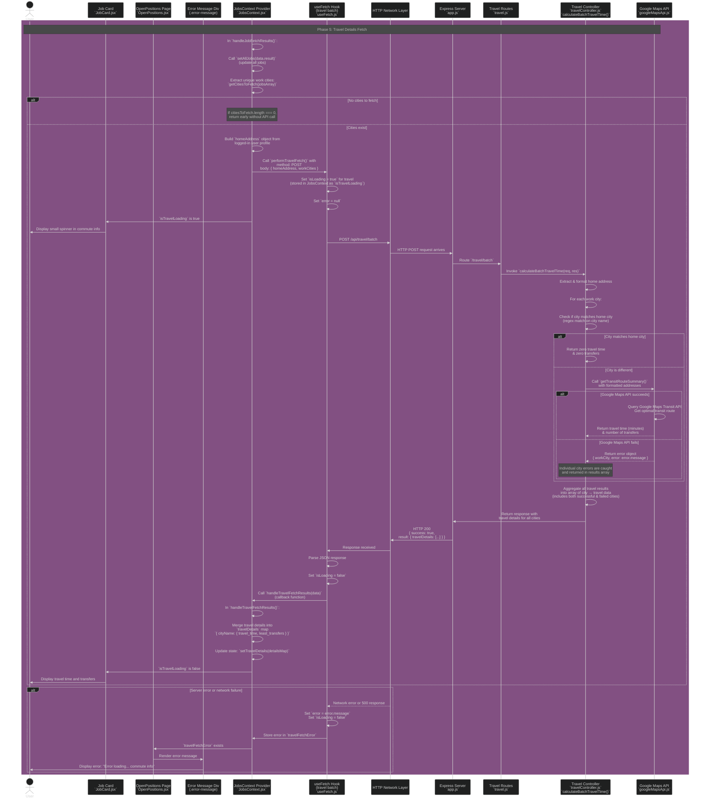

```mermaid
%%{init: {'theme': 'dark', 'themeVariables': { 'primaryColor':'#1a1a1a', 'primaryBorderColor':'#4a9eff', 'lineColor':'#4a9eff', 'tertiaryColor':'#2a2a2a', 'tertiaryBorderColor':'#4a9eff', 'tertiaryTextColor':'#ffffff'}, 'sequence': {'actorMargin': 50}}}%%
sequenceDiagram
    actor User
    participant JobCard as Job Card<br/>`JobCard.jsx`
    participant OpenPositions as OpenPositions Page<br/>`OpenPositions.jsx`
    participant ErrorDisplay as Error Message Div<br/>(.error-message)
    participant JobsContext as JobsContext Provider<br/>`JobsContext.jsx`
    participant useFetch_2 as useFetch Hook<br/>(travel batch)<br/>`useFetch.js`
    participant FrontendNetwork as HTTP Network Layer
    participant ExpressApp as Express Server<br/>`app.js`
    participant TravelRouter as Travel Routes<br/>`travel.js`
    participant TravelController as Travel Controller<br/>`travelController.js`<br/>`calculateBatchTravelTime()`
    participant GoogleMapsAPI as Google Maps API<br/>`googleMapsApi.js`

    rect rgb(130, 80, 130)
    Note over User,GoogleMapsAPI: Phase 5: Travel Details Fetch
    JobsContext->>JobsContext: In `handleJobFetchResults()`:
    JobsContext->>JobsContext: Call `setAllJobs(data.result)`<br/>(update all jobs)
    JobsContext->>JobsContext: Extract unique work cities:<br/>`getCitiesToFetch(jobsArray)`
    
    alt No cities to fetch
        Note over JobsContext: If citiesToFetch.length === 0,<br/>return early without API call
    else Cities exist
        JobsContext->>JobsContext: Build `homeAddress` object from<br/>logged-in user profile

        JobsContext->>useFetch_2: Call `performTravelFetch()` with<br/>method: POST<br/>body: { homeAddress, workCities }

        useFetch_2->>useFetch_2: Set `isLoading = true` for travel<br/>(stored in JobsContext as `isTravelLoading`)
        useFetch_2->>useFetch_2: Set `error = null`
        
        JobsContext->>JobCard: `isTravelLoading` is true
        JobCard->>User: Display small spinner in commute info
        
        useFetch_2->>FrontendNetwork: POST /api/travel/batch

        FrontendNetwork->>ExpressApp: HTTP POST request arrives
        ExpressApp->>TravelRouter: Route `/travel/batch`

        TravelRouter->>TravelController: Invoke `calculateBatchTravelTime(req, res)`

        TravelController->>TravelController: Extract & format home address
        TravelController->>TravelController: For each work city:
        TravelController->>TravelController: Check if city matches home city<br/>(regex match on city name)
        alt City matches home city
            TravelController->>TravelController: Return zero travel time<br/>& zero transfers
        else City is different
            TravelController->>GoogleMapsAPI: Call `getTransitRouteSummary()`<br/>with formatted addresses
            
            alt Google Maps API succeeds
                GoogleMapsAPI->>GoogleMapsAPI: Query Google Maps Transit API<br/>Get optimal transit route
                GoogleMapsAPI-->>TravelController: Return travel time (minutes)<br/>& number of transfers
            else Google Maps API fails
                GoogleMapsAPI-->>TravelController: Return error object<br/>{ workCity, error: error.message }
                Note over TravelController: Individual city errors are caught<br/>and returned in results array
            end
        end

        TravelController->>TravelController: Aggregate all travel results<br/>into array of city → travel data<br/>(includes both successful & failed cities)
        TravelController->>ExpressApp: Return response with<br/>travel details for all cities

        ExpressApp->>FrontendNetwork: HTTP 200<br/>{ success: true,<br/>  result: { travelDetails: [...] } }

        FrontendNetwork->>useFetch_2: Response received
        useFetch_2->>useFetch_2: Parse JSON response
        useFetch_2->>useFetch_2: Set `isLoading = false`
        useFetch_2->>JobsContext: Call `handleTravelFetchResults(data)`<br/>(callback function)

        JobsContext->>JobsContext: In `handleTravelFetchResults()`:
        JobsContext->>JobsContext: Merge travel details into<br/>`travelDetails` map<br/>`{ cityName: { travel_time, least_transfers } }`
        JobsContext->>JobsContext: Update state: `setTravelDetails(detailsMap)`
        
        JobsContext->>JobCard: `isTravelLoading` is false
        JobCard->>User: Display travel time and transfers
    end

    alt Server error or network failure
        FrontendNetwork-->>useFetch_2: Network error or 500 response
        useFetch_2->>useFetch_2: Set `error = error.message`<br/>Set `isLoading = false`
        useFetch_2->>JobsContext: Store error in `travelFetchError`
        
        JobsContext->>OpenPositions: `travelFetchError` exists
        OpenPositions->>ErrorDisplay: Render error message
        ErrorDisplay->>User: Display error: "Error loading... commute info"
    end

    end
```
