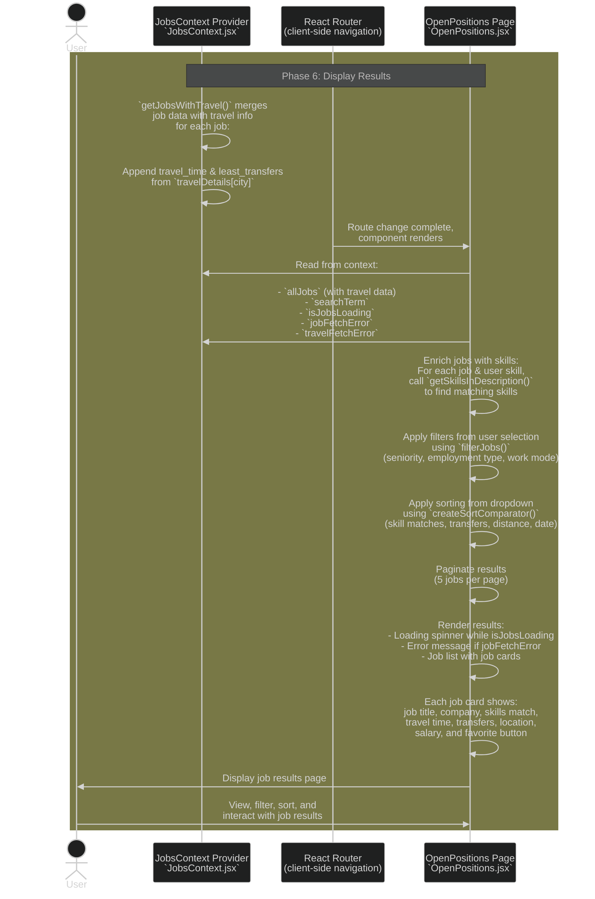

```mermaid
%%{init: {'theme': 'dark', 'themeVariables': { 'primaryColor':'#1a1a1a', 'primaryBorderColor':'#4a9eff', 'lineColor':'#4a9eff', 'tertiaryColor':'#2a2a2a', 'tertiaryBorderColor':'#4a9eff', 'tertiaryTextColor':'#ffffff'}, 'sequence': {'actorMargin': 50}}}%%
sequenceDiagram
    actor User
    participant JobsContext as JobsContext Provider<br/>`JobsContext.jsx`
    participant Router as React Router<br/>(client-side navigation)
    participant OpenPositions as OpenPositions Page<br/>`OpenPositions.jsx`

    rect rgb(120, 120, 70)
    Note over JobsContext,OpenPositions: Phase 6: Display Results
    JobsContext->>JobsContext: `getJobsWithTravel()` merges<br/>job data with travel info<br/>for each job:
    JobsContext->>JobsContext: Append travel_time & least_transfers<br/>from `travelDetails[city]`

    Router->>OpenPositions: Route change complete,<br/>component renders

    OpenPositions->>JobsContext: Read from context:
    OpenPositions->>JobsContext: - `allJobs` (with travel data)<br/>- `searchTerm`<br/>- `isJobsLoading`<br/>- `jobFetchError`<br/>- `travelFetchError`

    OpenPositions->>OpenPositions: Enrich jobs with skills:<br/>For each job & user skill,<br/>call `getSkillsInDescription()`<br/>to find matching skills

    OpenPositions->>OpenPositions: Apply filters from user selection<br/>using `filterJobs()`<br/>(seniority, employment type, work mode)

    OpenPositions->>OpenPositions: Apply sorting from dropdown<br/>using `createSortComparator()`<br/>(skill matches, transfers, distance, date)

    OpenPositions->>OpenPositions: Paginate results<br/>(5 jobs per page)

    OpenPositions->>OpenPositions: Render results:<br/>- Loading spinner while isJobsLoading<br/>- Error message if jobFetchError<br/>- Job list with job cards
    OpenPositions->>OpenPositions: Each job card shows:<br/>job title, company, skills match,<br/>travel time, transfers, location,<br/>salary, and favorite button
    OpenPositions->>User: Display job results page

    User->>OpenPositions: View, filter, sort, and<br/>interact with job results

    end
```
