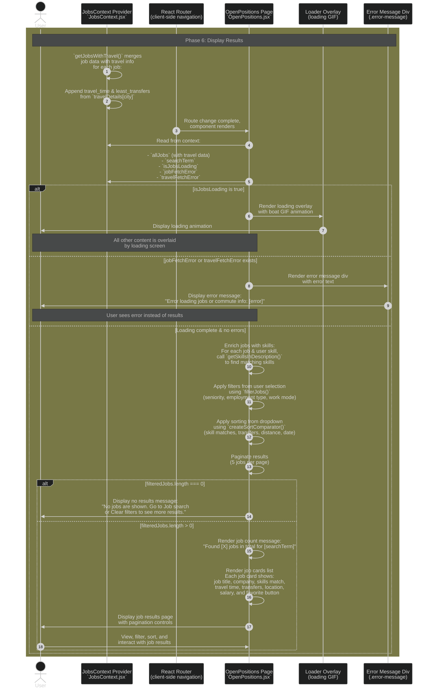

```mermaid
%%{init: {'theme': 'dark', 'themeVariables': { 'primaryColor':'#1a1a1a', 'primaryBorderColor':'#4a9eff', 'lineColor':'#4a9eff', 'tertiaryColor':'#2a2a2a', 'tertiaryBorderColor':'#4a9eff', 'tertiaryTextColor':'#ffffff'}, 'sequence': {'actorMargin': 50}}}%%
sequenceDiagram
    autonumber
    actor User
    participant JobsContext as JobsContext Provider<br/>`JobsContext.jsx`
    participant Router as React Router<br/>(client-side navigation)
    participant OpenPositions as OpenPositions Page<br/>`OpenPositions.jsx`
    participant LoaderOverlay as Loader Overlay<br/>(loading GIF)
    participant ErrorDisplay as Error Message Div<br/>(.error-message)

    rect rgb(120, 120, 70)
    Note over User,ErrorDisplay: Phase 6: Display Results
    JobsContext->>JobsContext: `getJobsWithTravel()` merges<br/>job data with travel info<br/>for each job:
    JobsContext->>JobsContext: Append travel_time & least_transfers<br/>from `travelDetails[city]`

    Router->>OpenPositions: Route change complete,<br/>component renders

    OpenPositions->>JobsContext: Read from context:
    OpenPositions->>JobsContext: - `allJobs` (with travel data)<br/>- `searchTerm`<br/>- `isJobsLoading`<br/>- `jobFetchError`<br/>- `travelFetchError`

    alt isJobsLoading is true
        OpenPositions->>LoaderOverlay: Render loading overlay<br/>with boat GIF animation
        LoaderOverlay->>User: Display loading animation
        Note over OpenPositions,User: All other content is overlaid<br/>by loading screen
    else jobFetchError or travelFetchError exists
        OpenPositions->>ErrorDisplay: Render error message div<br/>with error text
        ErrorDisplay->>User: Display error message:<br/>"Error loading jobs or commute info: [error]"
        Note over OpenPositions,User: User sees error instead of results
    else Loading complete & no errors
        OpenPositions->>OpenPositions: Enrich jobs with skills:<br/>For each job & user skill,<br/>call `getSkillsInDescription()`<br/>to find matching skills

        OpenPositions->>OpenPositions: Apply filters from user selection<br/>using `filterJobs()`<br/>(seniority, employment type, work mode)

        OpenPositions->>OpenPositions: Apply sorting from dropdown<br/>using `createSortComparator()`<br/>(skill matches, transfers, distance, date)

        OpenPositions->>OpenPositions: Paginate results<br/>(5 jobs per page)

        alt filteredJobs.length === 0
            OpenPositions->>User: Display no results message:<br/>"No jobs are shown. Go to Job search<br/>or Clear filters to see more results."
        else filteredJobs.length > 0
            OpenPositions->>OpenPositions: Render job count message:<br/>"Found [X] jobs in total for [searchTerm]"
            OpenPositions->>OpenPositions: Render job cards list<br/>Each job card shows:<br/>job title, company, skills match,<br/>travel time, transfers, location,<br/>salary, and favorite button
            OpenPositions->>User: Display job results page<br/>with pagination controls

            User->>OpenPositions: View, filter, sort, and<br/>interact with job results
        end
    end

    end
```
